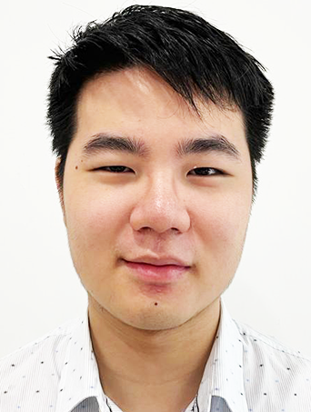
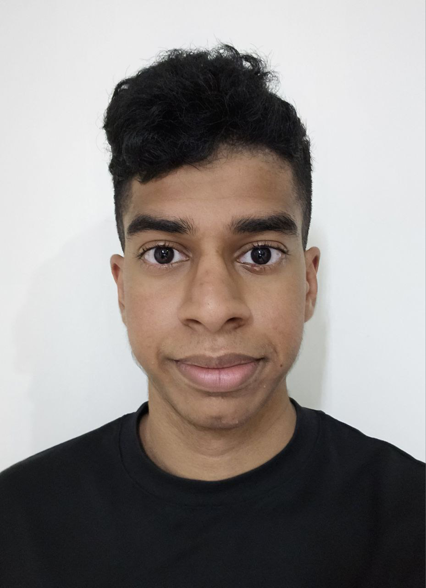

We are a team based in the [School of Computing, National University of Singapore](https://www.comp.nus.edu.sg).

## Project team

### Chen Linxin

[[github](https://github.com/clx3210)]

* Role: Developer
* Responsibilities: Feature Development, Code quality

### Ian Wong Wai Hoong

[[github](http://github.com/Wrongian)]

* Role: Developer
* Responsibilities: Feature Development, Team Lead

### Carine Ang

[[github](https://github.com/carineang)] 

* Role: Developer
* Responsibilities: Feature Development, UI

### Pranav Mahatma

[[github](http://github.com/pranavyey)]

* Role: Developer
* Responsibilities: Feature Development, Testing

### Xin Ni

[[github](http://github.com/xinniyee)]

* Role: Developer
* Responsibilities: Feature Development, Documentation
