* Table of Contents
{:toc}

--------------------------------------------------------------------------------------------------------------------

## **Acknowledgements**

* Notarius is based on the AddressBook-Level3 project created by the [SE-EDU initiative](https://se-education.org/).

--------------------------------------------------------------------------------------------------------------------

## **Setting up, getting started**

Refer to the guide [_Setting up and getting started_](SettingUp.md).

--------------------------------------------------------------------------------------------------------------------

## **Design**

:bulb: **Tip:** The `.puml` files used to create diagrams in this document `docs/diagrams` folder. Refer to the [_PlantUML Tutorial_ at se-edu/guides](https://se-education.org/guides/tutorials/plantUml.html) to learn how to create and edit diagrams.

### Architecture

The ***Architecture Diagram*** given above explains the high-level design of the App.

Given below is a quick overview of main components and how they interact with each other.

**Main components of the architecture**

**`Main`** (consisting of classes [`Main`](https://github.com/se-edu/addressbook-level3/tree/master/src/main/java/seedu/address/Main.java) and [`MainApp`](https://github.com/se-edu/addressbook-level3/tree/master/src/main/java/seedu/address/MainApp.java)) is in charge of the app launch and shut down.
* At app launch, it initializes the other components in the correct sequence, and connects them up with each other.
* At shut down, it shuts down the other components and invokes cleanup methods where necessary.

The bulk of the app's work is done by the following four components:

* [**`UI`**](#ui-component): The UI of the App.
* [**`Logic`**](#logic-component): The command executor.
* [**`Model`**](#model-component): Holds the data of the App in memory.
* [**`Storage`**](#storage-component): Reads data from, and writes data to, the hard disk.

[**`Commons`**](#common-classes) represents a collection of classes used by multiple other components.

**How the architecture components interact with each other**

The *Sequence Diagram* below shows how the components interact with each other for the scenario where the user issues the command `delete 1`.

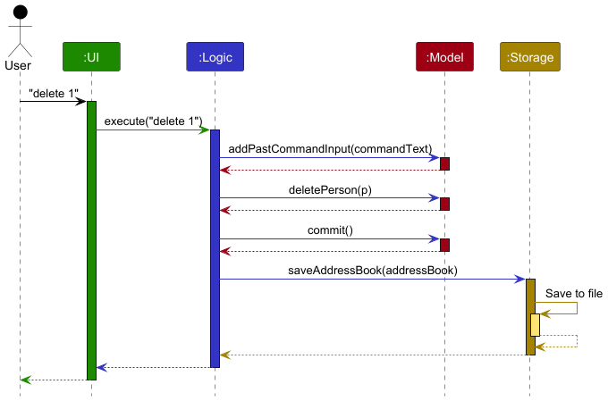

Each of the four main components (also shown in the diagram above),

* defines its *API* in an `interface` with the same name as the Component.
* implements its functionality using a concrete `{Component Name}Manager` class (which follows the corresponding API `interface` mentioned in the previous point.

For example, the `Logic` component defines its API in the `Logic.java` interface and implements its functionality using the `LogicManager.java` class which follows the `Logic` interface. Other components interact with a given component through its interface rather than the concrete class (reason: to prevent outside component's being coupled to the implementation of a component), as illustrated in the (partial) class diagram below.

The sections below give more details of each component.

### UI component

The **API** of this component is specified in [`Ui.java`](https://github.com/se-edu/addressbook-level3/tree/master/src/main/java/seedu/address/ui/Ui.java)

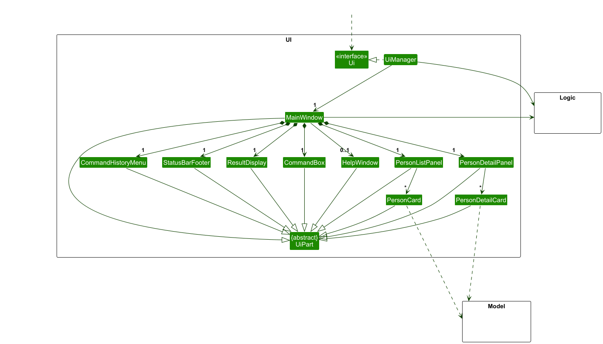

The UI consists of a `MainWindow` that is made up of parts such as `CommandBox`, `ResultDisplay`, `PersonListPanel`, 
`PersonDetailPanel`, `StatusBarFooter` and `HelpWindow`. All these, including the `MainWindow`, inherit from the abstract `UiPart` class which captures the commonalities between classes that represent parts of the visible GUI.

The `UI` component uses the JavaFx UI framework. The layout of these UI parts are defined in matching `.fxml` files that are in the `src/main/resources/view` folder. For example, the layout of the [`MainWindow`](https://github.com/se-edu/addressbook-level3/tree/master/src/main/java/seedu/address/ui/MainWindow.java) is specified in [`MainWindow.fxml`](https://github.com/se-edu/addressbook-level3/tree/master/src/main/resources/view/MainWindow.fxml)

The `UI` component,

* executes user commands using the `Logic` component.
* listens for changes to `Model` data so that the UI can be updated with the modified data.
* keeps a reference to the `Logic` component, because the `UI` relies on the `Logic` to execute commands.
* depends on some classes in the `Model` component, as it displays `Person` object residing in the `Model`.

### Logic component

**API** : [`Logic.java`](https://github.com/se-edu/addressbook-level3/tree/master/src/main/java/seedu/address/logic/Logic.java)

Here's a (partial) class diagram of the `Logic` component:

The sequence diagram below illustrates the interactions within the `Logic` component, taking `execute("delete 1")` API call as an example.

:information_source: **Note:** The lifeline for `DeleteCommandParser` should end at the destroy marker (X) but due to a limitation of PlantUML, the lifeline continues till the end of diagram.

How the `Logic` component works:

1. When `Logic` is called upon to execute a command, it is passed to an `AddressBookParser` object which in turn creates a parser that matches the command (e.g., `DeleteCommandParser`) and uses it to parse the command.
1. This results in a `Command` object (more precisely, an object of one of its subclasses e.g., `DeleteCommand`) which is executed by the `LogicManager`.
1. The command can communicate with the `Model` when it is executed (e.g. to delete a person). 
   Note that although this is shown as a single step in the diagram above (for simplicity), in the code it can take several interactions (between the command object and the `Model`) to achieve.
1. The result of the command execution is encapsulated as a `CommandResult` object which is returned back from `Logic`.

Here are the other classes in `Logic` (omitted from the class diagram above) that are used for parsing a user command:

How the parsing works:
* When called upon to parse a user command, the `AddressBookParser` class creates an `XYZCommandParser` (`XYZ` is a placeholder for the specific command name e.g., `AddCommandParser`) which uses the other classes shown above to parse the user command and create a `XYZCommand` object (e.g., `AddCommand`) which the `AddressBookParser` returns back as a `Command` object.
* All `XYZCommandParser` classes (e.g., `AddCommandParser`, `DeleteCommandParser`, ...) inherit from the `Parser` interface so that they can be treated similarly where possible e.g, during testing.

### Model component
**API** : [`Model.java`](https://github.com/se-edu/addressbook-level3/tree/master/src/main/java/seedu/address/model/Model.java)

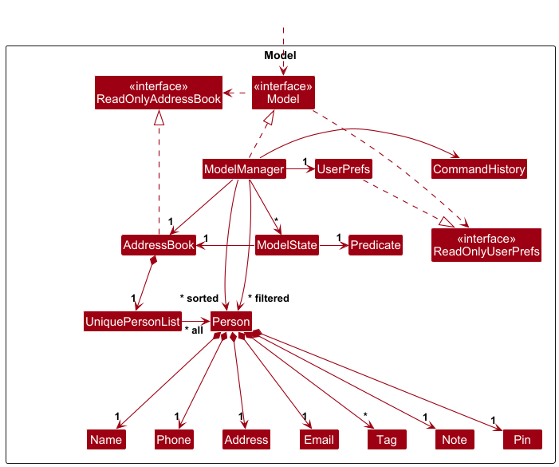

The `Model` component,

* stores the address book data i.e., all `Person` objects (which are contained in a `UniquePersonList` object).
* stores states of the model in the ModelState in order to undo/redo the states.
* stores the currently 'selected' `Person` objects (e.g., results of a search query) as a separate _filtered_ list which is exposed to outsiders as an unmodifiable `ObservableList<Person>` that can be 'observed' e.g. the UI can be bound to this list so that the UI automatically updates when the data in the list change.
* stores a `UserPref` object that represents the user’s preferences. This is exposed to the outside as a `ReadOnlyUserPref` objects.
* does not depend on any of the other three components (as the `Model` represents data entities of the domain, they should make sense on their own without depending on other components)

:information_source: **Note:** An alternative (arguably, a more OOP) model is given below. It has a `Tag` list in the `AddressBook`, which `Person` references. This allows `AddressBook` to only require one `Tag` object per unique tag, instead of each `Person` needing their own `Tag` objects. 

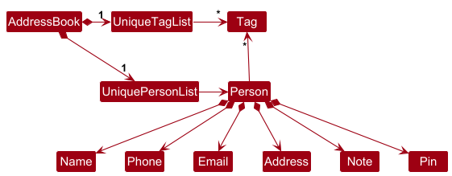

### Storage component

**API** : [`Storage.java`](https://github.com/se-edu/addressbook-level3/tree/master/src/main/java/seedu/address/storage/Storage.java)

The `Storage` component,
* can save both address book data and user preference data in JSON format, and read them back into corresponding objects.
* inherits from both `AddressBookStorage` and `UserPrefStorage`, which means it can be treated as either one (if only the functionality of only one is needed).
* depends on some classes in the `Model` component (because the `Storage` component's job is to save/retrieve objects that belong to the `Model`)

### Common classes

Classes used by multiple components are in the `seedu.address.commons` package.

--------------------------------------------------------------------------------------------------------------------

## **Implementation**

This section describes some noteworthy details on how certain features are implemented.

### List feature

The `list` command enables users to view all existing contacts from Notarius.

  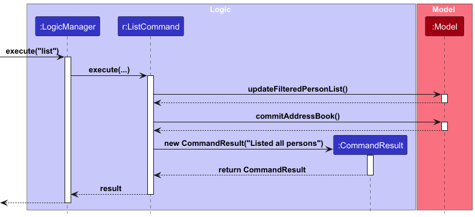

#### Implementation Details

1. The user inputs the command to list all contacts.
2. A `LogicManager` object invokes the `execute` method of a `ListCommand` object.
3. The `execute` method of the `ListCommand` object invokes the `updateFilteredPersonList` and
`commit` method of its `Model` to update and show all contacts.
4. The `execute` method of the `ListCommand` object returns a `CommandResult` object which stores the data regarding
the completion of the `list` command.

### Help feature

The `help` command allows users to view general application usage instructions or specific details about a command.

  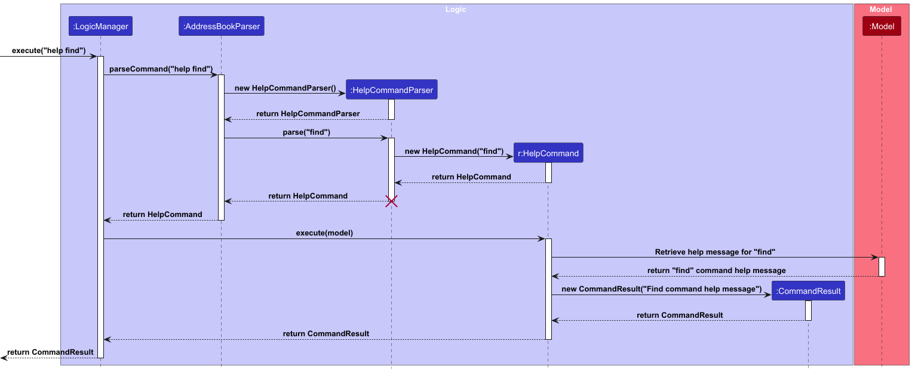

:information_source: **Note:** The lifeline for `HelpCommand` should end at the destroy marker (X) but due to a limitation of PlantUML, the lifeline reaches the end of diagram.

#### Implementation Details

1. The user inputs the command to request help, either as help for general help or help COMMAND_NAME for details on a specific command. 
2. A `HelpCommandParser` object invokes its `parse` method, which parses the user input:
   1. If no argument is provided, it returns a `HelpCommand` object for general help. 
   2. If a valid command name is provided, it returns a `HelpCommand` object with that command name. 
3. A `LogicManager` object invokes the `execute` method of the `HelpCommand` object. 
4. The execute method of the HelpCommand object checks if a command name was specified:
   1. If no command name is provided, it returns a `CommandResult` containing general help instructions. 
   2. If a valid command name is provided, it retrieves the corresponding help message from a predefined command-help mapping (`COMMAND_HELP`). 
   3. If an invalid command name is provided, it returns an error message stating that the command is unknown. 
5. The `execute` method of the `HelpCommand` object returns a `CommandResult` object that stores the help message or error message. 
6. The application displays the help message to the user, either in a popup window (for general help) or in the main interface (for specific commands).

### Clear feature

The `clear` command enables users to remove all existing contacts from Notarius.

  

#### Implementation Details

1. The user inputs the command to clear all contacts.
2. A `LogicManager` object invokes the `execute` method of a `ClearCommand` object.
3. The `execute` method of the `ClearCommand` object invokes the `setAddressBook` and `commit` method 
of its `Model` argument with a new `AddressBook` object which contains an empty `UniquePersonList` property.
4. The `execute` method of the `ClearCommand` object returns a `CommandResult` object which stores the data regarding 
the completion of the `clear` command.

### Sort feature

The `sort` command enables users to sort contacts in Notarius by prefix in lexicographical order.

  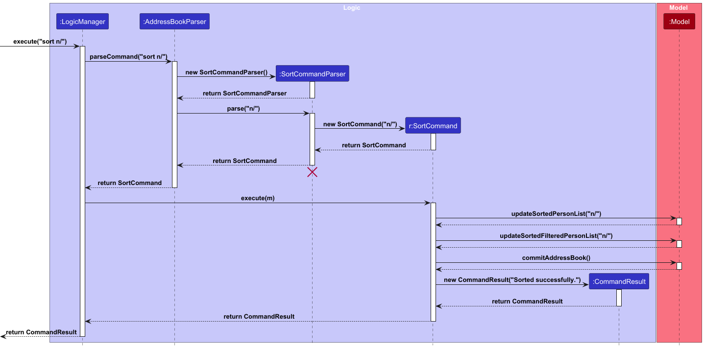

:information_source: **Note:** The lifeline for `SortCommand` should end at the destroy marker (X) but due to a limitation of PlantUML, the lifeline reaches the end of diagram.

#### Implementation Details

1. The user inputs the command to sort contacts with the specified prefix.
2. A `SortCommandParser` object invokes its `parse` method which parses the user input.
3. The `SortCommand` object is created with the parsed prefix.
4. A `LogicManager` object invokes the `execute` method of the `SortCommand` object.
5. The `execute` method of the `SortCommand` object invokes the `updateSortedPersonList`, 
`updateSortedFilteredPersonList` and `commit` methods of its `Model` argument to update and sort 
all contacts by the target prefix.
6. The `execute` method of the `SortCommand` object returns a `CommandResult` object which stores the data regarding 
the completion of the `sort` command.

#### Design Considerations
**Aspect: How to implement the sort command**
* Alternative 1 (current choice): Support multi-level sorting for up to two attributes, with tags as first attribute
  * Pros: It is easier for users to understand and use. Sorting by tags first allows contacts to be grouped into respective clusters, making it easier to find related contacts.
  * Cons: For users with complex needs, limiting sorting to two attributes may be restrictive. They may need the ability to sort by more attributes to meet their requirements.

* Alternative 2: Support multi-level sorting for more than two attributes
  * Pros: Advanced users with specific needs (e.g., sorting by tag, then name, then phone number) can get more control and precision in how they organize their contacts.
  * Cons: It might slow down the system, especially if the dataset is large or if sorting requires a lot of computation. 

### Find feature

The `find` command allows users to search for contacts in Notarius based on specified fields: 
name, phone, email, address, and tags. The search is case-insensitive and supports multiple keywords. 
Additionally, for name, email, and address fields, the search is tolerant of minor typos, allowing matches within a Levenshtein distance of 2.

  

:information_source: **Note:** The lifeline for `FindCommand` should end at the destroy marker (X) but due to a limitation of PlantUML, the lifeline reaches the end of diagram.

#### Implementation Details

1. The user enters the `find` command with the desired search criteria. 
2. The `LogicManager` invokes the parseCommand method of AddressBookParser to identify the command type. 
3. If the command is recognized as `find`, the `FindCommandParser` is instantiated. 
4. The `FindCommandParser` extracts the search parameters and keywords, ensuring correct parsing of multi-word inputs enclosed in double quotes (""). 
5. A new `FindCommand` object is created using the parsed search fields and keywords. 
6. The `LogicManager` executes the `FindCommand` object, which:
   1. Calls `updateFilteredPersonList` and `commit` method in `Model` to filter contacts based on the search fields and keywords. 
   2. Uses a case-insensitive check for all fields. 
   3. Applies Levenshtein distance ≤ 2 matching for `name`, `email`, and `address`. 
7. The `FindCommand` returns a `CommandResult`, displaying the filtered list of contacts matching the search criteria.

#### Design Considerations

* Lenient Matching Using Levenshtein Distance
    * The `find` command supports typo-tolerant search using Levenshtein distance, 
but only for fields where user errors are likely—such as `name`, `email`, and `address`.  
    * This was a deliberate design choice to improve usability, allowing users to find contacts even with small typing mistakes.
* Default Field Matching Behavior
  * If no prefix is provided (e.g. `find Al`), the system assumes the user is searching by `name`.
  * This decision was made to streamline common use cases, since most searches tend to be name-based.

### Delete feature

The `delete` command allows the user to delete specified client contact(s) from Notarius.

The sequence diagram below models the different components of the application that are involved
when the user executes the `delete` command.
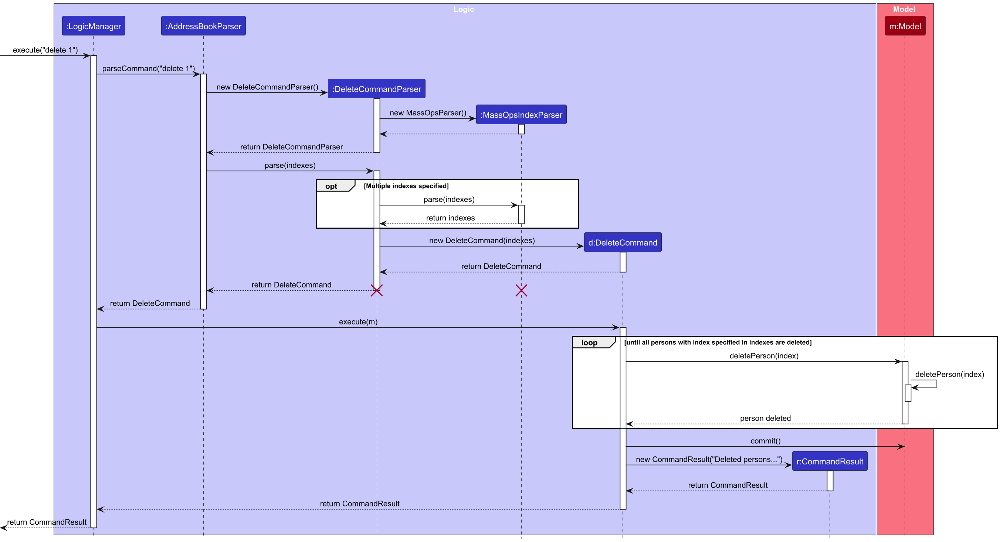

:information_source: **Note:** The lifeline for `DeleteCommand` should end at the destroy marker (X) but due to a limitation of PlantUML, the lifeline reaches the end of diagram.

#### Implementation Details

1. The user executes a command to delete a contact by specifying the contact's index.
2. The `LogicManager` receives the command and calls `AddressBookParser#parseCommand` to parse the command.
3. The `AddressBookParser` creates a `DeleteCommandParser` object, which creates a `MassOpsIndexParser` object for parsing multiple indexes.
4. The `AddressBookParser` then calls the `parse` method of the newly created `DeleteCommandParser` object.
5. If the delete method specifies the `i/` prefix with the corresponding value being either a ranged format (`startIndex-endIndex`) or spaced format (`index1 index2 ... indexN`), the `parse` method of `MassOpsIndexParser` will be called to parse the indexes.
6. A new `DeleteCommand` object is created with the returned set of unique indexes from the parser, and gets returned back to the `LogicManager`.
7. The `LogicManager` calls the `execute` method of the `DeleteCommand` object.
8. The `DeleteCommand` object calls the `Model#deletePerson` method for each of the set of unique indexes in decreasing order of the index's `zeroBasedIndex`.
9. After all `indexes` specified have been deleted, `Model#commitAddressBook` is called on the `Model` argument to save the changes made to the list of persons in the addressbook.

#### Usage Examples

1. User starts Notarius
2. User executes `delete i/1-3`
3. The client contacts with indexes 1, 2 and 3 will be deleted from Notarius. This change should be reflected in the client contact list.

**Aspect: How to implement the delete command**

* **Alternative 1 (current choice):** Support deletion of multiple client contacts with intuitive delete formats
    * Pros: Intuitive to use, and improved user-friendliness. Users do not have to repeatedly type the same command to delete clients one-by-one.
    * Cons: More complicated to implement, due to the need of parsing multiple indexes, ignoring duplicates, and ensuring valid parsing according to the multiple specified formats.

* **Alternative 2:** Support deletion of only one client contact at a time using a single format
    * Pros: Simpler to implement, as the command will only need to parse one index.
    * Cons: Less user-friendly, as users will have to spend more time and trouble to repeatedly type the same command to delete potentially many clients one-by-one.

### Command history

The command history allows the user to re-access previously entered commands quickly.

The following sequence diagram models the interaction within the `Model` component called by `LogicManager#execute`
when the user executes a command to **save command inputs**.
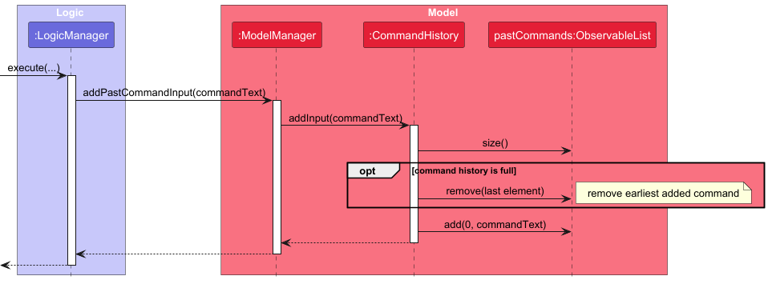

#### Implementation Details: Saving commands to command history

1. When a user enters a non-empty command, the `ModelManager#addPastCommandInput` method will be called when the command text in `LogicManager` component is non-empty.
2. The `ModelManager` calls `CommandHistory#addInput` and passes the non-empty command text as argument.
3. If the command history's most recently added command is `equal` to the command text argument, the command text is not re-added again.
4. Otherwise, if the command history is currently full, with `MAX_HISTORY_SIZE` entries (set to 20), the earliest added command entry will be removed.
5. The `CommandHistory` object will add the command to `pastCommands`.

Note that `pastCommands` is an `ObservableList` sorted from most to least recent at the tail of the list.

 

The following sequence diagram models the main components involved when a user moves up the command history selection
using the `Ctrl + Up` key combinations on Windows (or `Ctrl + Opt + Up` on macOS), to **re-access previous commands**.
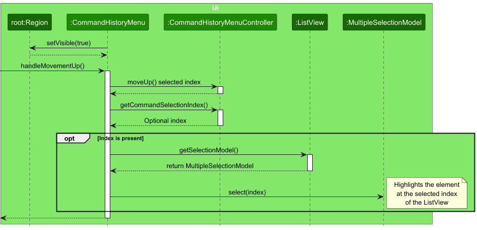

#### Implementation Details: Re-accessing command history

1. When the user presses `Ctrl + Up`, the subscribed for the `EventHandler<KeyEvent>` JavaFX listener will be called.
2. The listener then calls `handleMovementUp` method of the `CommandHistoryMenu` in the Ui module.
3. The `CommandHistoryMenu` object calls the `moveUp` method of an internal `CommandHistoryMenuController` object to handle the logic
   of decrementing the index.
4. In `moveUp` then sets the current input of the `CommandBox` object through a call to `CommandBox#setCommandTextField` with the selected previous command.
5. The `CommandHistoryMenu` object then gets a result of this selection update by calling `CommandHistoryMenuController#getCommandSelectionIndex`
6. If the index is present within this result, the `CommandHistoryMenu` object gets the `SelectionModel` for rendering the given list cell of `ListView`
7. The `select` method of the `SelectionModel` object is then called with the index passed as argument.

#### Usage Examples
1. User launches Notarius
2. User enters a non-empty command.
3. User re-accesses the previously entered command using the command history shortcuts:
    * Windows/Linux: `Ctrl + Up`/`Ctrl + Down` to move up/down the selection.
    * macOS: `Ctrl + Opt + Up`/ `Ctrl + Opt + Down` similarly.

**Aspect: Command history design considerations**

* **Alternative 1 (current choice):** Support addition of some invalid commands, with duplicate handling for consecutively entered inputs
    * Pros: More user-friendliness, allows users to re-access and quickly re-edit past commands, if they have typed them wrong by accident, without having to retype the entire command.
    * Cons: May slightly clutter the command history with invalid commands if the user spams **different** invalid commands intentionally, which is not the intended behaviour.

* **Alternative 2:** Support addition of only valid commands
    * Pros: Allows users to find previously entered valid commands that they want to repeat.
    * Cons: Less user-friendly, since users will not be able to re-access previously entered commands that they have typed incorrectly, and will have to retype the entire command again.

### Note feature
The note feature allows the user to change and view notes. \
The user changes notes via the `note` command and the user views notes via the `viewnote` command.

#### Implementation Details

This is how a user changes their note via the `note` command:
1. The user inputs the command to change their note of a contact of a specific index.
2. A `NoteCommandParser` object invokes its `parse` method which parses the user input.
3. The `NoteCommand` object is created with the parsed prefix and specified index.
4. A `LogicManager` object invokes the `execute` method of the `NoteCommand` object.
5. The `execute` method of the `NoteCommand` object modifies the specified clientContact with a new note invokes the `setPerson`,
and `commit` methods of its `Model` argument to change the note of the person.
6. The `execute` method of the `NoteCommand` object returns a `CommandResult` object which stores the data regarding
   the completion of the `note` command.

This is how a user views their note via the `viewnote` command:
1. The user inputs the command to view a note of a contact of a specific index.
2. A `ViewNoteCommandParser` object invokes its `parse` method which parses the user input.
3. The `ViewNoteCommand` object is created with the specified index.
4. A `LogicManager` object invokes the `execute` method of the `ViewNoteCommand` object.
5. The `execute` method of the `ViewNoteCommand` object invokes the getFilteredPersonList of the `Model` and gets the note of the clientContact as the specified index and
   does the `commit` method of the `Model` as well.
6. The `execute` method of the `ViewNoteCommand` object returns a `CommandResult` object which stores the data regarding
   the completion of the `viewnote` command, if successful includes the note of the client contact at the specified index.

### Undo/redo feature
The `undo` and `redo` commands undoes and redoes other commands respectively. 

#### Implementation Details

* The proposed undo/redo mechanism is facilitated by `ModelState`. 
* The `ModelState` is a save state of the `Model`.
* The `ModelState` saves the `ReadOnlyAddressBook` and `Predicate<Person>` of the `Model`.
* 'ModelState' objects are stored in the `Model` as `stateHistory` which is an `ArrayList<ModelState>`.
* Undo/redo is facilitated by a `currentStatePointer` which points to the current `ModelState` in the `stateHistory`.

Additionally, the `Model` implements and exposes the following operations to facilitate the undo/redo process:
* `Model#commit()` — Saves the current `ModelState` in the `stateHistory`.
* `Model#undo()` — Restores the previous `ModelState` from its `stateHistory`.
* `Model#redo()` — Restores a previously undone `ModelState` from its `stateHistory`.

Given below is an example usage scenario and how the undo/redo mechanism behaves at each step.

Step 1. The user launches the application for the first time. The `stateHistory` will be initialised with the initial `ModelState` of the newly initialised `Model`, and the `currentStatePointer` pointing to that single `ModelState`.

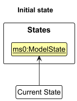

Step 2. The user executes `delete 5` command to delete the 5th person in the address book of the `Model`. The `delete` command calls `Model#commit()`, causing the modified state of the address book after the `delete 5` command executes to be saved in the `stateHistory` as a `ModelState`, and the `currentStatePointer` is shifted to the newly inserted `ModelState`.

Step 3. The user executes `add n/David …​` to add a new person. The `add` command also calls `Model#commit()`, causing another modified address book state in the newly created `ModelState` to be saved into the `stateHistory`.

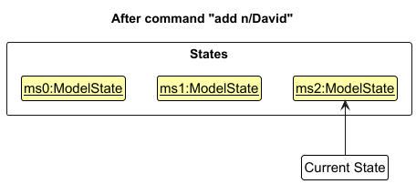

:information_source: **Note:** If a command fails its execution, it will not call `Model#commit()`, so the `ModelState` will not be saved into the `stateHistory`.

Step 4. The user now decides that adding the person was a mistake, and decides to undo that action by executing the `undo` command. The `undo` command will call `Model#undo()`, which will shift the `currentStatePointer` once to the left, pointing it to the previous `ModelState`, and restores the `Model` to that state.

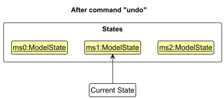

:information_source: **Note:** If the `currentStatePointer` is at index 0 pointing to the initial `ModelState`, then there are no previous `ModelState` states to restore. The `undo` command uses `Model#hasUndo()` to check if this is the case. If so, it will return an error to the user rather
than attempting to perform the undo.

The following sequence diagram shows how an undo operation goes through the `Logic` component:

:information_source: **Note:** The lifeline for `UndoCommand` should end at the destroy marker (X) but due to a limitation of PlantUML, the lifeline reaches the end of diagram.

The `redo` command does the opposite — it calls `Model#redo()`, which shifts the `currentStatePointer` once to the right, pointing to the previously undone `ModelState`, and restores the `Model` to that state.

:information_source: **Note:** If the `currentStatePointer` is at index `stateHistory.size() - 1`, pointing to the latest `ModelState` state, then there are no undone `ModelState` to restore. The `redo` command uses `Model#hasRedo()` to check if this is the case. If so, it will return an error to the user rather than attempting to perform the redo.

Step 5. The user executes `clear`, which calls `Model#commit()`. Since the `currentStatePointer` is not pointing at the end of the `stateHistory`, all `ModelState` states after the `currentStatePointer` will be purged. Reason: It no longer makes sense to redo the `add n/David …​` command. This is the behavior that most modern desktop applications follow.

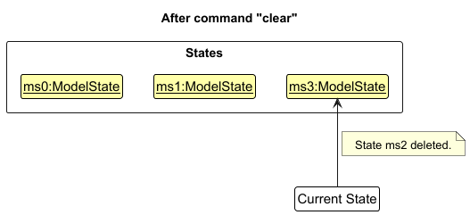

The following activity diagram summarizes what happens when a user executes a new command:

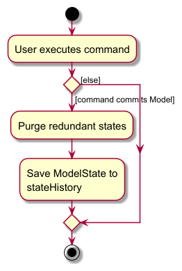

--------------------------------------------------------------------------------------------------------------------

## **Documentation, logging, testing, configuration, dev-ops**

* [Documentation guide](Documentation.md)
* [Testing guide](Testing.md)
* [Logging guide](Logging.md)
* [Configuration guide](Configuration.md)
* [DevOps guide](DevOps.md)

--------------------------------------------------------------------------------------------------------------------

## **Appendix: Requirements**

### Product scope

**Target user profile**: Lawyers

* has a need to manage a significant number of contacts
* prefer desktop apps over other types
* can type fast
* prefers typing to mouse interactions
* is reasonably comfortable using CLI apps

**Value proposition**: manage contacts faster than a typical mouse/GUI driven app

### User stories

Priorities: High (must have) - `* * *`, Medium (nice to have) - `* *`, Low (unlikely to have) - `*`

| Priority | As a …​                                                           | I want to …​                                                      | So that I can…​                                                                             |
|----------|-------------------------------------------------------------------|-------------------------------------------------------------------|---------------------------------------------------------------------------------------------|
| `* * *`  | lawyer                                                            | list all contacts with their relevant details                     | easily peruse them                                                                          |
| `* * *`  | lawyer                                                            | add a contact's name                                              | identify the individual easily                                                              |
| `* * *`  | lawyer                                                            | add a contact's phone number                                      | contact them by phone                                                                       |
| `* * *`  | lawyer                                                            | add a contact's email                                             | contact them by email                                                                       |
| `* * *`  | lawyer                                                            | add a contact's address                                           | know where to mail legal documents physically to                                            |
| `* * *`  | lawyer                                                            | save my contacts to my _local system_                             | access them later after reopening the application                                           |
| `* * *`  | lawyer with many clients                                          | search for contacts                                               | easily find out their contact information                                                   |
| `* * *`  | lawyer                                                            | delete contacts                                                   | remove client contacts that I no longer need                                                |
| `* * *`  | lawyer                                                            | access my contacts without internet                               | so that I can continue to work effectively in places with limited to no internet connection |
| `* *`    | busy lawyer who is working with multiple clients at the same time | add notes to contacts                                             | keep track of their relevant case-related details, preferences, and personal details        |
| `* *`    | busy lawyer who is working with multiple clients at the same time | view a contact's notes                                            | see their relevant case-related details, preferences, and personal details                  |
| `* *`    | lawyer                                                            | sort the contacts                                                 | improve the organisation of my client contacts                                              |
| `* *`    | forgetful lawyer                                                  | pin important clients                                             | look up their information faster                                                            |
| `* *`    | lawyer                                                            | unpin currently pinned clients                                    | keep my pinned list of clients up to date                                                   |
| `* *`    | lawyer who can type fast                                          | re-access previously entered commands quickly                     | save time by not typing them again                                                          |
| `* *`    | lawyer with many clients                                          | delete multiple client contacts at once                           | clear clients from past cases faster and more conveniently                                  |
| `* *`    | forgetful lawyer                                                  | view a quick help summary for certain commands                    | quickly relearn how to perform certain commands in case I forgot how to use them            |
| `* *`    | lawyer                                                            | edit client contact details                                       | keep client contact information up to date                                                  |
| `* *`    | lawyer trying the application for the first time                  | clear all the client contact data                                 | start fresh from a clean state                                                              |
| `* *`    | careless lawyer                                                   | undo my previous commands                                         | easily revert my mistakes                                                                   |
| `* *`    | careless lawyer                                                   | redo my previous commands                                         | easily revert my mistakes from undoing                                                      |
| `* *`    | lawyer                                                            | tag contacts (e.g., "Plaintiff", "Defendant", "Under Review")     | remember their roles easily                                                                 |
| `* *`    | lawyer                                                            | set reminders to follow up with contacts                          | make sure to not miss an important check-in                                                 |
| `* *`    | lawyer                                                            | tag multiple contacts at once                                     | categorise them for my needs more efficiently and conveniently                              |
| `* *`    | lawyer                                                            | add multiple tags to a contact                                    | organise my contacts neatly and not have to keep tagging the same contact multiple times    |
| `* *`    | impatient lawyer                                                  | get the output of my commands quickly and responsively            | save time without having to wait long for the command output                                |
| `* *`    | lawyer                                                            | have a user-friendly and uncluttered interface to navigate around | focus on my legal work without getting distracted by complicated or cluttered visuals       |
| `*`      | lawyer                                                            | have my notes be automatically time-stamped                       | keep track of when notes were created                                                       |
| `*`      | busy lawyer                                                       | use command aliases to enter commands faster                      | save time and improve efficiency                                                            |
| `*`      | lawyer                                                            | add general post-it notes                                         | store information that is not related to any case or contact                                |
| `*`      | lawyer                                                            | assign contacts to specific cases                                 | keep track of all clients involved in a legal matter                                        |
| `*`      | busy lawyer                                                       | view all contacts of specific cases                               | quickly access their case details when needed                                               |
| `*`      | lawyer                                                            | unlink contacts related from cases                                | update case information when necessary                                                      |
| `*`      | lawyer                                                            | add notes to cases                                                | view case information when needed                                                           |

### Use cases

(For all use cases below, the **System** is `Notarius` and the **Actor** is the `User`, unless specified otherwise)

**System**: `Notarius`

**Actor**: `User`

**Use Case**: `UC01 - Deleting client contacts`

**Guarantees**: `If MSS reaches step 4, the requested client contact(s) will be deleted`

**MSS**:
1. User requests to list contacts.
2. Notarius displays a list of contacts.
3. User requests to delete specific contacts in the list.
4. Notarius deletes the contacts and confirms that the contacts have been deleted.

   Use case ends.

**Extensions**:

* 1a. Notarius detects an invalid list command from the user.
  * 1a1. Notarius alerts the user about the error.
  * 1a2. User retypes the command.
  * Steps 1a-1a2 are repeated until the command format is valid.
  * Use case resumes from step 2.

* 3a. Notarius is unable to find some of the specified contact(s).
  * 3a1. Notarius alerts the user about the error.
  * 3a2. User retypes the command.
  * Steps 3a-3a2 are repeated until the specified contact(s) exist.
  * Use case resumes from step 4.

* 3b. Notarius uncovers a prefix with an empty value.
  * 3b1. Notarius alerts the user about the issue.
  * 3b2. User retypes the command with a non-empty value for the specified prefix.
  * Steps 3b-3b2 are repeated until the prefix is no longer empty.
  * Use case resumes from step 4.

* 3c. Notarius uncovers some invalid contact identifiers.
  * 3c1. Notarius alerts the user about the issue.
  * 3c2. User retypes the command with a valid contact identifier format.
  * Steps 3c-3c2 are repeated until the contact identifier is valid.
  * Use case resumes from step 4.

**System**: `Notarius`

**Actor**: `User`

**Use Case**: `UC02 - Adding client contacts`

**Guarantees**: `If MSS reaches step 3, the client contact is successfully added to Notarius.`

**MSS**:
1. User opens the application and requests to add a client contact.
2. User enters the `add` command with all required fields (e.g., name, phone number, email, and address).
3. Notarius adds the client contact and confirms the addition.

   Use case ends.

**Extensions**:

* 2a. User omits one or more required fields in the command.
  * 2a1. Notarius alerts the user about the missing fields.
  * 2a2. User retypes the command with all required fields.
  * Use case resumes from step 3.

* 2b. User enters a contact with a phone number that already exists in the system.
  * 2b1. Notarius alerts the user that a duplicate contact exists.
  * 2b2. User may choose to modify the phone number or cancel the action.
  * Use case resumes from step 3 if the user modifies and resubmits the command.

* 2c. User enters an invalid phone number or email format.
  * 2c1. Notarius alerts the user about the incorrect format.
  * 2c2. User retypes the command with valid formats.
  * Use case resumes from step 3.

* 2d. User adds optional fields (e.g., tags or notes).
  * 2d1. Notarius includes those fields in the newly created contact.
  * Use case resumes from step 3.

**System**: `Notarius`

**Actor**: `User`

**Use Case**: `UC03 - Editing a contact`

**Guarantees**: `If MSS reaches step 2, the contact will have the specified field updated correctly to the new value`

**MSS**:
1. User requests to edit field of a contact given by their id.
2. Notarius updates that field to the new value and confirms the contact has been edited.

   Use case ends.

**Extensions**:
* 1a. Notarius is unable to find the specified contact.
  * 1a1. Notarius alerts the user about the error.
  * 1a2. User retypes the command.
  * Steps 1a-1a2 are repeated until the contact specified exists.
  * Use case resumes from step 2.

* 1b. Notarius uncovers an empty field description.
  * 1b1. Notarius alerts the user about the issue.
  * 1b2. User retypes the command with a non-empty value for the specified field.
  * Steps 1b-1b2 are repeated until the field is no longer empty.
  * Use case resumes from step 2.

* 1c. Notarius uncovers that the format of the field the user entered is invalid.
  * 1c1. Notarius alerts the user about the error.
  * 1c2. User retypes the command with a valid field format.
  * Steps 1c-1c2 are repeated until the field format is valid.
  * Use case resumes from step 2.

* 1d. Notarius uncovers an invalid contact identifier.
  * 1d1. Notarius alerts the user about the issue.
  * 1d2. User retypes the command with a valid contact identifier format.
  * Steps 1d-1d2 are repeated until the contact identifier is valid.
  * Use case resumes from step 2.

**System**: `Notarius`

**Use Case**: `UC04 - Adding a note to contact`

**Actor**: `User`

**Guarantees**: `A new note is added to the contact.`

**MSS**:

1. User requests to add a note to a contact.
2. Notarius adds the note to the contact’s list of notes and confirms the successful addition of the note.

   Use case ends.

**Extensions**:

* 1a. Notarius uncovers a missing description field in the entered input.
  * 1a1. Notarius displays the error message.
  * 1a2. User retypes the command with the description field.
  * Use case resumes from step 2.

* 1b. Notarius is unable to find the specified contact.
  * 1b1. Notarius alerts the user about the error.
  * 1b2. User retypes the command.
  * Steps 1b-1b2 are repeated until the contact specified exists.
  * Use case resumes from step 2.

* 1c. Notarius uncovers an invalid note description.
  * 1c1. Notarius alerts the user about the error.
  * 1c2. User retypes the command with a valid note description format.
  * Steps 1c-1c2 are repeated until the note description format is valid.
  * Use case resumes from step 2.

* 1d. Notarius uncovers an empty field description.
  * 1d1. Notarius alerts the user about the issue.
  * 1d2. User retypes the command with a non-empty value for the specified field.
  * Steps 1d-1d2 are repeated until the field is no longer empty.
  * Use case resumes from step 2.

* 1e. Notarius uncovers an invalid contact identifier.
  * 1e1. Notarius alerts the user about the issue.
  * 1e2. User retypes the command with a valid contact identifier format.
  * Steps 1e-1e2 are repeated until the contact identifier is valid.
  * Use case resumes from step 2.

**System**: `Notarius`

**Use Case**: `UC05 - Editing a note of a contact`

**Actor**: `User`

**Guarantees**: `The specified fields of the note are updated to the correct values.`

**MSS**:

1. User requests to edit a field of a specified note of a contact.
2. Notarius updates the note and confirms the note has been successfully edited.

   Use case ends.

**Extensions**:

* 1a. Notarius uncovers an invalid note identifier.
  * 1a1. Notarius alerts the user about the issue.
  * 1a2. User retypes the command with a valid note identifier format.
  * Steps 1a-1a2 are repeated until the contact identifier is valid.
  * Use case resumes from step 2.

* 1b. Notarius is unable to find the specified contact.
  * 1b1. Notarius alerts the user about the error.
  * 1b2. User retypes the command.
  * Steps 1b-1b2 are repeated until the contact specified exists.
  * Use case resumes from step 2.

* 1c. Notarius is unable to find the specified note.
  * 1c1. Notarius alerts the user of the error.
  * 1c2. User retypes the command.
  * Steps 1c-1c2 are repeated until the specified note exists.
  * Use case resumes from step 2.

* 1d. Notarius uncovers an invalid note description.
  * 1d1. Notarius alerts the user about the error.
  * 1d2. User retypes the command with a valid note description format.
  * Steps 1d-1d2 are repeated until the note description is valid.
  * Use case resumes from step 2.

* 1e. Notarius uncovers an empty field description.
  * 1e1. Notarius alerts the user about the issue.
  * 1e2. User retypes the command with a non-empty value for the specified field.
  * Steps 1e-1e2 are repeated until the field is no longer empty.
  * Use case resumes from step 2.

* 1f. Notarius uncovers an invalid contact identifier.
  * 1f1. Notarius alerts the user about the issue.
  * 1f2. User retypes the command with a valid contact identifier format.
  * Steps 1f-1f2 are repeated until the contact identifier is valid.
  * Use case resumes from step 2.

**System**: `Notarius`

**Actor**: `User`

**Use Case**: `UC06 - Deleting a note of a contact.`

**Guarantees**: `The specified note is deleted successfully.`

**MSS**:

1. User specifies the note of a contact to delete.
2. System deletes the note and confirms the successful deletion.

   Use case ends.

**Extensions**:

* 1a. Notarius is unable to find the specified note.
  * 1a1. Notarius alerts the user of the error.
  * 1a2. User retypes the command.
  * Steps 1a-1a2 are repeated until the specified note exists.
  * Use case resumes from step 2.

* 1b. Notarius uncovers an invalid note identifier.
  * 1b1. Notarius alerts the user about the issue.
  * 1b2. User retypes the command with a valid note identifier format.
  * Steps 1b-1b2 are repeated until the contact identifier is valid.
  * Use case resumes from step 2.

* 1c. Notarius is unable to find the specified contact.
  * 1c1. Notarius alerts the user about the error.
  * 1c2. User retypes the command.
  * Steps 1c-1c2 are repeated until the contact specified exists.
  * Use case resumes from step 2.

* 1d. Notarius uncovers an invalid contact identifier.
  * 1d1. Notarius alerts the user about the issue.
  * 1d2. User retypes the command with a valid contact identifier format.
  * Steps 1d-1d2 are repeated until the contact identifier is valid.
  * Use case resumes from step 2.

**System**: `Notarius`

**Actor**: `User`

**Use Case**: `UC07 - Getting all notes belonging to a contact`

**Guarantees**: `All notes belonging to the specified contact are displayed.`

**MSS**:

1. User requests for the notes of a contact.
2. Notarius displays all notes belonging to the contact.

   Use case ends.

**Extensions**:

* 1a. Notarius is unable to find the specified contact.
  * 1a1. Notarius alerts the user about the error.
  * 1a2. User retypes the command.
  * Steps 1a-1a2 are repeated until the contact specified exists.
  * Use case resumes from step 2.

* 1b. Notarius uncovers an invalid contact identifier.
  * 1b1. Notarius alerts the user about the issue.
  * 1b2. User retypes the command with a valid contact identifier format.
  * Steps 1b-1b2 are repeated until the contact identifier is valid.
  * Use case resumes from step 2.

* 2a. Notarius cannot find any notes related to the contact.
  * 2a1. Notarius displays a blank note.
  * Use case ends.

**System**: `Notarius`

**Actor**: `User`

**Use Case**: `UC08 - Accessing an input from the command history`

**Preconditions**: `Command history is open.`

**MSS**:

1. User selects a command input from the command history.
2. Notarius prepares the selected command to be entered.
3. User enters the command.
4. Notarius executes the command and closes the command history.

   Use case ends.

**extensions**

* 1a. Notarius is unable to find any command in the history.
    * 1a1. Notarius alerts the user with a message.
    * 1a2. User enters a new command.
    * Use case resumes from step 4.

* 3a. User requests to edit the command input with a new value.
    * 3a1. Notarius updates the selected command input with the new value.
    * Use case resumes from step 3.

* *a. At any time, user requests to close the command history.
    * *a1. Notarius closes the command history.
    * Use case ends.

**System**: `Notarius`

**Actor**: `User`

**Use Case**: `UC09 - Sorting the contacts list`

**Guarantees**: `If MSS reaches step 3, the user has successfully sorted the contacts list by a specified prefix.`

**MSS**:

1. User requests to sort Notarius by a specified prefix.
2. Notarius updates the contacts list in the sorted order.
3. Notarius confirms that the contacts list has been successfully sorted.

   Use case ends.

**Extensions**:

* 1a. Notarius detects a missing prefix in the entered input.
  * 1a1. Notarius displays the error message.
  * 1a2. User re-enters a new command with a specified prefix.
  * Steps 1a1 - 1a2 are repeated until a valid prefix is input by the User.
  * Use case resumes from step 2.

* 1b. Notarius detects an invalid prefix in the entered input.
  * 1b1. Notarius displays the error message.
  * 1b2. User re-enters a new command with a specified prefix.
  * Steps 1b1 - 1b2 are repeated until a valid field is input by the User.
  * Use case resumes from step 2.

* 1c. User enters extra spaces or invalid format in the entered input.
  * 1c1. Notarius displays an error message.
  * 1c2. User re-enters a new command with properly formatted command.
  * Steps 1c1 - 1c2 are repeated until a valid command is input by the User.
  * Use case resumes from step 2.

* 1d. User enters duplicate prefixes in the entered input.
  * 1d1. Notarius displays an error message.
  * 1d2. User re-enters a new command with no duplicate prefixes.
  * Steps 1d1 - 1d2 are repeated until a valid command with no duplicate prefixes is input by the User.
  * Use case resumes from step 2.

**System**: `Notarius`

**Actor**: `User`

**Use Case**: `UC10 - Clearing the contacts list`

**Guarantees**: `If MSS reaches step 3, the user has successfully cleared the contacts list.`

**MSS**:

1. User requests to clear the data in the contacts list.
2. Notarius updates the data in the contacts list.
3. Notarius confirms that the data in the contacts list has been cleared.

   Use case ends.

**System**: `Notarius`

**Actor**: `User`

**Use Case**: `UC11 - Listing all contacts`

**Guarantees**: `If MSS reaches step 3, the user has successfully listed all the contacts.`

**MSS**:

1. User requests to list all contacts.
2. Notarius displays all relevant contacts.
3. Notarius confirms that all relevant contacts has been successfully listed.

   Use case ends.

**System**: `Notarius`

**Actor**: `User`

**Use Case**: `UC12 - Displaying Help Information`

**Guarantees**: `If MSS reaches step 2, the requested help information will be displayed.`

**MSS**:

1. User requests help by entering the help command. 
2. Notarius displays a help window with general usage instructions.

   Use case ends.

**Extensions**:

* 1a. User requests help for a specific command. 
  * 1a1. Notarius displays detailed usage information for the specified command. 
    Use case ends.

* 1b.  User enters an invalid command name. 
  * 1b1. Notarius alerts the user with an error message: "Unknown command! Use help to see available commands."
  * 1b2. User retypes the command with a valid usgae. 
    Steps 1b1-1b2 are repeated until a valid command is entered. 
    Use case resumes from step 1a1.

**System**: `Notarius`

**Actor**: `User`

**Use Case**: `UC13 - Finding a Contact`

**Guarantees**: `If MSS reaches step 3, a list of matching contacts will be displayed.`

**MSS**:

1. User requests to find contacts by entering the find command with specified fields and keywords. 
2. Notarius searches for contacts whose fields contain any of the given keywords, 
allowing minor typos (up to a Levenshtein distance of 2) in the name, email, and address fields only. 
3. Notarius displays a list of matching contacts with index numbers.

   Use case ends.

**Extensions**:

* 1a. User enters an invalid search format. 
  * 1a1. Address Book alerts the user with an error message about the incorrect format. 
  * 1a2. User retypes the command following the correct format. 
    Steps 1a1-1a2 are repeated until the command format is valid. 
    Use case resumes from step 2.
* 2a. No contacts match the search criteria. 
  * 2a1. Address Book displays a message indicating that no matching contacts were found. 
    Use case ends.
* 2b. User enters multiple search fields. 
  * 2b1. Address Book searches for contacts that match any of the 
  specified fields (name, phone, email, address, or tags). 
    Use case resumes from step 3.
* 2c. User enters a keyword with minor typos in the phone or tag fields. 
  * 2c1. Address Book does not apply typo correction for phone numbers or tags. 
  * 2c2. If an exact match is not found, Address Book displays a message indicating no results were found. 
    Use case ends.
* 2d. User enters a keyword with minor typos in the name, email, or address fields. 
  * 2d1. Address Book applies fuzzy matching (Levenshtein distance of up to 2) for name, email, and address fields. 
    Use case resumes from step 3.

**System**: `Notarius`

**Actor**: `User`

**Use Case**: `UC14 - Pinning a client contact`

**Guarantees**: `If MSS reaches step 3, the client contact is marked as pinned.`

**MSS**:

1. User requests to pin a contact in the current contact list.
2. User enters the `pin` command followed by the index of the contact to pin.
3. Notarius marks the contact as pinned and confirms the action with a success message.

   Use case ends.

**Extensions**:

* 2a. User omits the index in the pin command.
  * 2a1. Notarius alerts the user that an index must be provided.
  * 2a2. User retypes the command with a valid index.
  * Use case resumes from step 3.

* 2b. User enters an index that is out of range.
  * 2b1. Notarius alerts the user that the index is invalid.
  * 2b2. User retypes the command with a valid index.
  * Use case resumes from step 3.

* 3a. The contact is already pinned.
  * 3a1. Notarius notifies the user that the contact is already pinned.
  * Use case ends.

**System**: `Notarius`

**Actor**: `User`

**Use Case**: `UC15 - Unpinning a client contact`

**Guarantees**: `If MSS reaches step 3, the client contact is marked as unpinned.`

**MSS**:

1. User requests to unpin a contact in the current contact list.
2. User enters the `unpin` command followed by the index of the contact to unpin.
3. Notarius marks the contact as unpinned and confirms the action with a success message.

   Use case ends.

**Extensions**:

* 2a. User omits the index in the unpin command.
  * 2a1. Notarius alerts the user that an index must be provided.
  * 2a2. User retypes the command with a valid index.
  * Use case resumes from step 3.

* 2b. User enters an index that is out of range.
  * 2b1. Notarius alerts the user that the index is invalid.
  * 2b2. User retypes the command with a valid index.
  * Use case resumes from step 3.

* 3a. The contact is already unpinned.
  * 3a1. Notarius notifies the user that the contact is already unpinned.
  * Use case ends.

### Non-Functional Requirements

1. Should work on any _mainstream OS_ as long as it has Java `17` or above installed.
2. Should be able to hold up to 1000 contacts without a noticeable lag in user requests.
3. A user with _above average typing speed_ for regular English text (i.e. not code, not system admin commands) should be able to accomplish most of the tasks faster using commands than using the mouse.
4. Data should be stored locally as human editable file.
5. Software should work without an installer.
6. GUI should work well with standard screen resolutions 1920x1080 and higher, and for screen scales 100% and 125%.
7. GUI should be usable for resolutions 1280x720 and higher, and for screen scales 150%.
8. Application should come packaged as a single jar file.
9. The `.jar/.zip` file should not exceed 100 MB.
10. Documents packaged with the application should each not exceed 15 MB per file.
11. The application should respond within 5 seconds to any user request.

### Glossary

| **Terms**                  | **Meaning**                                                                                                                                            |
|----------------------------|--------------------------------------------------------------------------------------------------------------------------------------------------------|
| Mainstream OS              | Windows, Linux, Unix, MacOS.                                                                                                                           |
| Above-average typing speed | ≥ 60 words per minute.                                                                                                                                 |
| Crucial client information | Important client information such as name, phone number, email, address, tags, as well as notes stored that could contain legal information for cases. |
| Local system               | The user's computer that they are using to run the application.                                                                                        |
| Cases (in law)             | The legal disputes that lawyers work on that involve many parties.                                                                                     |
| User Request               | The commands the user gives to Notarius via the command line interface.                                                                                |
| MSS                        | Main Success Scenario.                                                                                                                                 |
| API                        | Application Programming Interface.                                                                                                                     |
| GUI                        | Graphic User Interface.                                                                                                                                |
| CLI                        | Command Line Interface.                                                                                                                                |
| JAR                        | A packed file format used in Java that contains compiled Java code to enable easy distribution, portability, and execution.                            |
| JSON                       | JavaScript Object Notation, a lightweight data format widely used for storing and exchanging structured data.                                          |

--------------------------------------------------------------------------------------------------------------------

## **Appendix: Instructions for manual testing**

Given below are instructions to test the app manually.

:information_source: **Note:** These instructions only provide a starting point for testers to work on;
testers are expected to do more *exploratory* testing.

### Launch and shutdown

1. Initial launch

   1. Download the jar file and copy into an empty folder

   1. Double-click the jar file Expected: Shows the GUI with a set of sample contacts. The window size may not be optimum.

1. Saving window preferences

   1. Resize the window to an optimum size. Move the window to a different location. Close the window.

   1. Re-launch the app by double-clicking the jar file. 
       Expected: The most recent window size and location is retained.

### Deleting client contacts

Each test case in this feature section (labelled "Test case") should be independent.

1. Deleting a single client contact while all persons are being shown

   1. Prerequisites for each test case: List all persons using the `list` command. There should be **at least** 6 contacts in the list. Otherwise, use the `add` command to add more client contacts. Take note that duplicate names (ignoring letter casing) are not allowed in Notarius.

   2. Test case: `delete 1` 
      Expected: First client contact is deleted from the list. Details of the deleted contact shown in the status message. Timestamp in the status bar is updated.

   3. Test case: `delete 0` 
      Expected: No person is deleted. Error details shown in the status message. Status bar remains the same.

   4. Other incorrect delete commands to try: `delete`, `delete x`, `...` (where x is larger than the list size) 
      Expected: Similar to previous.
   
2. Deleting consecutive client contacts while all persons are being shown

   1. Prerequisites for each test case: List all persons using the `list` command, ensuring that there are **exactly** 6 contacts in the list. Otherwise, use the `add` command to add more client contacts. Take note that duplicate names (ignoring letter casing) are not allowed in Notarius.

   1. Test case: `delete i/1-3` 
      Expected: First three client contacts are deleted from the list. Details of the deleted contacts shown in the status message. Timestamp in the status bar is updated.
   
   1. Test case: `delete  i/1-1` 
      Expected: First client contact is deleted from the list. Details of the deleted contact shown in the status message. Timestamp in the status bar is updated.

   1. Test case: `delete i/0-2` 
      Expected: No person is deleted. Error details shown in the status message. Status bar remains the same.
   
   1. Test case: `delete i/1-9` 
      Expected: No person is deleted. Error details shown in the status message. Status bar remains the same.

   1. Test case: `delete i/6-1` 
      Expected: No person is deleted. Error details shown in the status message. Status bar remains the same.

3. Deleting the first and last client contact in the contact list while all client contacts are shown.

   1. Prerequisites for each test case: List all persons using the `list` command, ensuring that there are **exactly** 6 contacts in the list. Otherwise, use the `add` command to add more client contacts. Take note that duplicate names (ignoring letter casing) are not allowed in Notarius.

   1. Test case: `delete i/1 6` 
      Expected: First and last client contacts are deleted from the list. Details of the deleted contacts shown in the status message. Timestamp in the status bar is updated.
   
   1. Test case: `delete i/1 1 6 6 6` 
      Expected: First and last client contacts are deleted from the list. Details of the deleted contacts shown in the status message. Timestamp in the status bar is updated.
   
   1. Test case: `delete i/0 7` 
      Expected: No person is deleted. Error details shown in the status message. Status bar remains the same.

### Command history

Each test case in this feature section (labelled "Test case") should be independent. 
**Important**: For the key combinations specified, macOS users should use `Ctrl + Opt + Up`/`Ctrl + Opt + Down` respectively instead of `Ctrl + Up`/`Ctrl + Down`.

1. Saving command history

   1. Prerequisites for each test case: 
        * No command should be entered into the command box yet (and thus the command history should be empty). Otherwise, relaunch the application.
        * There should be **exactly** 6 contacts in the list. Otherwise, use the `add` command to add more client contacts. Take note that duplicate names (ignoring letter casing) are not allowed in Notarius.
        * **None** of the contacts should have a name equal to "notarius", **ignoring** letter casing. Otherwise, delete that contact using `delete` and add a new contact that does not have a duplicate name.

   1. Test case: `delete 1` 
      Expected: The command history is updated with the command text "delete 1". The command history is displayed when the user presses `Ctrl + Up` or `Ctrl + Down`.

   1. Test case: `delete 1` followed by `add n/notarius p/1231 e/test@email.com a/blk 123 abc` 
      Expected: The command history is updated with the command texts `add n/notarius p/1231 e/test@email.com a/blk 123 abc` at the top of the command history list and `delete 1` below it. The command history is displayed when the user presses `Ctrl + Up` or `Ctrl + Down`, and selection changes when pressing `Ctrl + Up` or `Ctrl + Down` again. When the selection changes, the command text in the command box is updated to the selected command.

   1. Test case: `list` followed by `list` 
      Expected: The command history is updated with the command text "list", but only once with no **consecutive** duplicates. The command history is displayed when the user presses `Ctrl + Up` or `Ctrl + Down`.

### Finding a person

1. Finding a person while all persons are being shown
   1. Prerequisites: List all persons using `list` command. Multiple persons in the list.
   2. Test case: `find n/"Alice"`  
      Expected: Displays all contacts with names that match "Alice" (case-insensitive) or have a name with levenshtein distance <= 2 to "ALICE".
   3. Test case: `find n/"Alice" "Bob"`  
      Expected: Displays all contacts with names containing either "Alice" or "Bob".
   4. Test case: `find n/"Alice" e/"alice@email.com" a/"Bedok Central"`  
      Expected: Displays all contacts where any of the fields match or have a levenshtein distance <= 2 from each keyword.
   5. Test case: `find t/"client" p/"12345678"`  
      Expected: Displays contacts that exactly match either tag "client" or phone "12345678".
   6. Test case: `find n/"NonExistentName"`  
      Expected: "0 persons listed!" message is displayed.

### Displaying help

1. Showing help in Notarius
   1. Prerequisites: Notarius is open and running
   2. Test case: `help`  
      Expected: A help window appears displaying instructions for using the application. The status message confirms that the help window has been opened.
   3. Test case: `help find`  
      Expected: The application displays detailed instructions for the find command, including expected parameters and format. 
   4. Test case: `help delete`  
      Expected: The application displays detailed instructions for the delete command, including expected parameters and format.
   5. Test case: `help meeee` (invalid command)  
      Expected: Error message: "Unknown command! Use 'help' to see available commands."

### Sorting contacts list

1. Sorting contacts list in Notarius
   1. Prerequisites: Notarius contains a list of contacts.
   2. Test case: `sort n/` 
   Expected: Displays all contacts sorted by names in ascending order.
   3. Test case: `sort p/` 
   Expected: Displays all contacts sorted by phone numbers in ascending order.
   4. Test case: `sort e/` 
   Expected: Displays all contacts sorted by email addresses in ascending order.
   5. Test case: `sort a/` 
   Expected: Displays all contacts sorted by addresses in ascending order.
   6. Test case: `sort t/` 
   Expected: Displays all contacts sorted by tags in ascending order.
   7. Test case: `sort t/ n/` 
   Expected: Displays all contacts sorted by tags, followed by names in ascending order.
   8. Test case: `sort t/ p/` 
   Expected: Displays all contacts sorted by tags, followed by phone numbers in ascending order.
   9. Test case: `sort t/ e/` 
   Expected: Displays all contacts sorted by tags, followed by email addresses in ascending order.
   10. Test case: `sort t/ a/` 
   Expected: Displays all contacts sorted by tags, followed by addresses in ascending order.

### Listing all contacts

1. List all contacts

   1. Test case: `list` 
      Expected: Displays the whole contacts list.

### Clearing all contacts

1. Clear all contacts 

  1. Test case: `clear` 
     Expected: Clears the whole contacts list.

### Saving data

1. Dealing with missing/corrupted data files

   1. _{explain how to simulate a missing/corrupted file, and the expected behavior}_

1. _{ more test cases …​ }_

## **Appendix: Planned Enhancements**:

### 1. Allow for international phone number format to be entered

#### Current:
In phone input fields, user only can enter a number. This restricts the user from being able to enter country codes.
This would reduce the application's usefulness as an address book application due to its limitation of storing
international client contacts. 

#### Planned:
To enhance usability and global compatibility. We should allow the user to enter the country code along with the phone number 
in phone input fields.

### 2. Bulk tag deletion capability

#### Current:
Via the edit command, all tags can be deleted or tags can be replaced with new ones. 
However, If a singular client contact has many tags and the 
user wants to delete a few tags from them, this would be decently cumbersome as the user has to retype in the tags
they do not want to replace.

#### Planned:
Add a command to delete multiple tags from a client contact.

### 3. Support for longer notes.

#### Current:
Notes are entered through a command line and are designed to write short and simple notes. However, users may 
want to write longer notes with more formatting options. Longer notes may be cumbersome experience to view in the
command output.

#### Planned:
If we want to stick fully to a CLI, we can add longer multi-line notes by using a prompt-based input technique where 
the user can enter line after line by using the `note` command. When the user wants to stop entering lines of the note
they can type the command `donenote`. This can be enhanced by allowing formatting options such as bolding. Long notes
can also be displayed better by making the command output collapsible.

### 5. More specific error messages for `delete` command.

#### Current:
When the delete command fails to delete specified contact(s), 
the error message shows "Invalid command format!" followed by the delete command usage, instead of providing
useful information on why the command failed.

#### Planned:
The application should be able to provide more informative error messages such as "Maximum number of contacts exceeded" when
the maximum number of unique indexes specified for deletion exceeds 100, or for range-formats, when the start index and end index do not conform to the constraints
specified in the user guide.

### 6. Selecting a client contact in contact list

#### Current:
When a new command is called, the selected contact in the contact list will be unselected by the application.

#### Planned:
The client contact will still be selected even though a new command is called. In addition, users can have the option to select or unselect the client contact.
