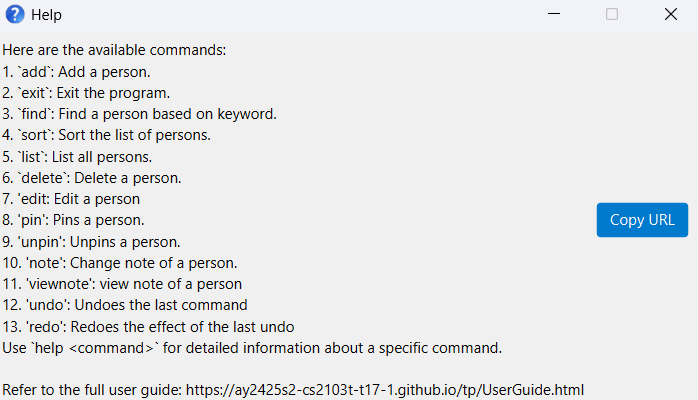

* Table of Contents
{:toc}

--------------------------------------------------------------------------------------------------------------------

## Introducing Notarius

*Ever a **fast-typing lawyer** with **too many** clients to keep track of manually in your old and slow contact app? We offer a **far better** alternative.*

**Notarius** is a **desktop addressbook** application on ***steroids***, meticulously refined for **lawyers** to track and manage their
clients' contact information. The app speeds up client contact management processes by providing fast-typing lawyers with a **Command Line Interface** (CLI) based input,
while also providing a seamless and intuitive **Graphical User Interface** (GUI) for visual cues to those who prefer it.

## Notarius Feature Overview

While this application may seem *as-if* it were a *typical* address-book application, allowing you to 
list, add, edit and delete client contacts, **Notarius** is packed with convenient and essential features that drive your productivity at work,
helping to provide you with a seamless experience. You can reaccess previously typed commands, undo/redo them, 
take down notes of your clients, pin important client contacts, search and even sort them!

Feature | Purpose
--------|------------------
Note | Add and view notes of client contacts to keep track of important information about them.
Pin/Unpin | Pin and unpin client contacts to easily track important client information.
Sort | Sort clients by key attributes to easily find certain clients
Find | Filters clients by various fields along with how similar they are to the query
Undo/Redo | Undo and redo commands to easily correct mistakes
Command History | View and reaccess previously typed commands

## Glossary of terms

While exploring this user guide, you may come across some terms that you may not be familiar with. 
Here is a list of commonly used terminology to provide better clarity.

Term(s) | Meaning
--------|----------
Prefix | Prefixes are format-specific keywords that are used to specify the type of data following it. For instance, `n/` is a prefix that specifies that the data following it is the name of a client.
Command | Command refers to a user's input into the input box of the application. Commands are used to interact with Notarius and perform various operations such as deleting a contact.

## Quick start

1. Ensure you have Java `17` or above installed in your Computer. 
   **Mac users:** Ensure you have the precise JDK version prescribed [here](https://se-education.org/guides/tutorials/javaInstallationMac.html).

1. Download the latest `.jar` file from [here](https://github.com/AY2425S2-CS2103T-T17-1/tp/releases).

1. Copy the file to the folder you want to use as the _home folder_ for your AddressBook.

1. Open a command terminal, `cd` into the folder you put the jar file in, and use the `java -jar notarius.jar` command to run the application. 
   A GUI similar to the below should appear in a few seconds. Note how the app contains some sample data. 
   

1. Type the command in the command box and press Enter to execute it. e.g. typing **`help`** and pressing Enter will open the help window. 
   Some example commands you can try:

   * `list` : Lists all contacts.

   * `add n/John Doe p/98765432 e/johnd@example.com a/John street, block 123, #01-01` : Adds a contact named `John Doe` to the Address Book.

   * `delete 3` : Deletes the 3rd contact shown in the current list.

   * `clear` : Deletes all contacts.

   * `exit` : Exits the app.

1. Refer to the [Features](#features) below for details of each command.

--------------------------------------------------------------------------------------------------------------------

## Features

**:information_source: Notes about the command format:** 

* Words in `UPPER_CASE` are the parameters to be supplied by the user. 
  e.g. in `add n/NAME`, `NAME` is a parameter which can be used as `add n/John Doe`.

* Items in square brackets are optional. 
  e.g `n/NAME [t/TAG]` can be used as `n/John Doe t/friend` or as `n/John Doe`.

* Items with `…`​ after them can be used multiple times including zero times. 
  e.g. `[t/TAG]…​` can be used as ` ` (i.e. 0 times), `t/friend`, `t/friend t/family` etc.

* Parameters can be in any order. 
  e.g. if the command specifies `n/NAME p/PHONE_NUMBER`, `p/PHONE_NUMBER n/NAME` is also acceptable.

* Extraneous parameters for commands that do not take in parameters (such as `help`, `list`, `exit` and `clear`) will be ignored. 
  e.g. if the command specifies `help 123`, it will be interpreted as `help`.

* If you are using a PDF version of this document, be careful when copying and pasting commands that span multiple lines as space characters surrounding line-breaks may be omitted when copied over to the application.

### Viewing help : `help`

Shows a message explaning how to access the help page.

Format: `help`

### Deleting person(s) : `delete`

Deletes the specified person(s) from the address book.

Formats: 
1. `delete INDEX`
    * Deletes the person at the specified `INDEX`.
2. `delete i/INDEX INDEX1 INDEX2 ... INDEXN`
    * Deletes the persons specified at the indexes: `INDEX1`, `INDEX2`, ... up to `INDEXN`
3. `delete i/START_INDEX-END_INDEX`
    * Deletes the persons whose index is specified from `START_INDEX` to `END_INDEX` inclusive.
    * `START_INDEX` must be `<=` `END_INDEX`.

Examples:

![[deleteIndexSpaced]](images/deleteIndexSpaced.png)

An example of deleting the first 3 client contacts after listing

 

* `list` followed by `delete 2` 
  * Deletes the 2nd person in the address book. 
* `list` followed by `delete i/1-2` 
  * Deletes the 1st and 2nd persons in the address book.
* `list` followed by `delete i/2 3` 
  * Deletes the 2nd and 3rd person in the address book.
* `find Betsy` followed by `delete 1` 
  * Deletes the 1st person in the results of the `find` command.
* `find Alex` followed by `delete i/1-2` 
  * Deletes the 1st and 2nd person in the results of the `find` command.

**:information_source: Index constraints:** 

* The indexes must refer to the index numbers shown in the displayed person list.

* The indexes **must be a positive integer** 1, 2, 3, …​

* All specified indexes must correspond to some index number shown in the displayed person list, otherwise the command fails.

* Duplicate indexes specified will be treated *as-if* that index was specified only once.

* Up to 100 indexes can be specified (either via spaced or ranged format); beyond which the command will fail.

### Adding a person: `add`

Adds a person to the address book.

Format: `add n/NAME p/PHONE_NUMBER e/EMAIL a/ADDRESS [t/TAG]…​`

:bulb: **Tip:**
A person can have any number of tags (including 0)

Examples:
* `add n/John Doe p/98765432 e/johnd@example.com a/John street, block 123, #01-01`
* `add n/Betsy Crowe t/friend e/betsycrowe@example.com a/Newgate Prison p/1234567 t/criminal`

### Listing all persons : `list`

Shows a list of all persons in the address book.

Format: `list`

### Editing a person : `edit`

Edits an existing person in the address book.

Format: `edit INDEX [n/NAME] [p/PHONE] [e/EMAIL] [a/ADDRESS] [t/TAG]…​`

* Edits the person at the specified `INDEX`. The index refers to the index number shown in the displayed person list. The index **must be a positive integer** 1, 2, 3, …​
* At least one of the optional fields must be provided.
* Existing values will be updated to the input values.
* When editing tags, the existing tags of the person will be removed i.e adding of tags is not cumulative.
* You can remove all the person’s tags by typing `t/` without
    specifying any tags after it.

Examples:
*  `edit 1 p/91234567 e/johndoe@example.com` Edits the phone number and email address of the 1st person to be `91234567` and `johndoe@example.com` respectively.
*  `edit 2 n/Betsy Crower t/` Edits the name of the 2nd person to be `Betsy Crower` and clears all existing tags.

### Locating persons by name: `find`

Finds persons whose names contain any of the given keywords.

Format: `find KEYWORD [MORE_KEYWORDS]`

* The search is case-insensitive. e.g `hans` will match `Hans`
* The order of the keywords does not matter. e.g. `Hans Bo` will match `Bo Hans`
* Only the name is searched.
* Only full words will be matched e.g. `Han` will not match `Hans`
* Persons matching at least one keyword will be returned (i.e. `OR` search).
  e.g. `Hans Bo` will return `Hans Gruber`, `Bo Yang`

Examples:
* `find John` returns `john` and `John Doe`
* `find alex david` returns `Alex Yeoh`, `David Li` 
  

### Clearing all entries : `clear`

Clears all entries from the address book.

Format: `clear`

### Exiting the program : `exit`

Exits the program.

Format: `exit`

### Command history

We know it can be **very annoying** to re-type commands consisting of long client details, especially due to a small typo. 

As such, Notarius keeps a history of the commands you have entered. You can navigate through the history using the `Ctrl + Up` and `Ctrl + Down` arrow keys.

**MacOS users:** Use `Ctrl + Opt + Up` and `Ctrl + Opt + Down` arrow keys instead.

![[commandHistory]](images/commandHistory.png)

An example of re-accessing a previous edit command

### Saving the data

AddressBook data are saved in the hard disk automatically after any command that changes the data. There is no need to save manually.

### Editing the data file

Notarius data are saved automatically as a JSON file `[JAR file location]/data/addressbook.json`. Advanced users are welcome to update data directly by editing that data file.

:exclamation: **Caution:**
If your changes to the data file makes its format invalid, AddressBook will discard all data and start with an empty data file at the next run. Hence, it is recommended to take a backup of the file before editing it. 
Furthermore, certain edits can cause the AddressBook to behave in unexpected ways (e.g., if a value entered is outside of the acceptable range). Therefore, edit the data file only if you are confident that you can update it correctly.

### Archiving data files `[coming in v2.0]`

_Details coming soon ..._

--------------------------------------------------------------------------------------------------------------------

## FAQ

**Q**: How do I transfer my data to another Computer? 
**A**: Install the app in the other computer and overwrite the empty data file it creates with the file that contains the data of your previous AddressBook home folder.

--------------------------------------------------------------------------------------------------------------------

## Known issues

1. **When using multiple screens**, if you move the application to a secondary screen, and later switch to using only the primary screen, the GUI will open off-screen. The remedy is to delete the `preferences.json` file created by the application before running the application again.
2. **If you minimize the Help Window** and then run the `help` command (or use the `Help` menu, or the keyboard shortcut `F1`) again, the original Help Window will remain minimized, and no new Help Window will appear. The remedy is to manually restore the minimized Help Window.

--------------------------------------------------------------------------------------------------------------------

## Command summary

Action | Format, Examples
--------|------------------
**Add** | `add n/NAME p/PHONE_NUMBER e/EMAIL a/ADDRESS [t/TAG]…​`   e.g., `add n/James Ho p/22224444 e/jamesho@example.com a/123, Clementi Rd, 1234665 t/friend t/colleague`
**Clear** | `clear`
**Delete** | `delete INDEX`, `delete i/START_INDEX-END_INDEX`, `delete i/INDEX1 INDEX2 ..`  e.g., `delete 3`, `delete i/1-2`, `delete i/1 3 5`
**Edit** | `edit INDEX [n/NAME] [p/PHONE_NUMBER] [e/EMAIL] [a/ADDRESS] [t/TAG]…​`  e.g.,`edit 2 n/James Lee e/jameslee@example.com`
**Find** | `find KEYWORD [MORE_KEYWORDS]`  e.g., `find James Jake`
**List** | `list`
**Help** | `help`
