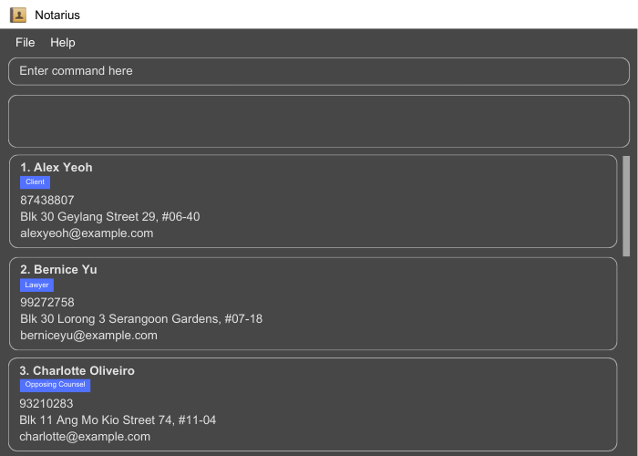
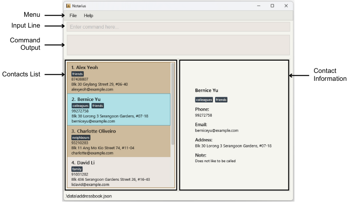
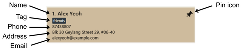
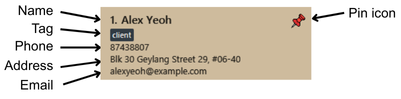
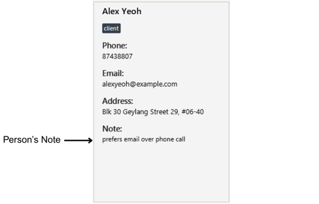
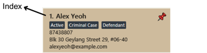
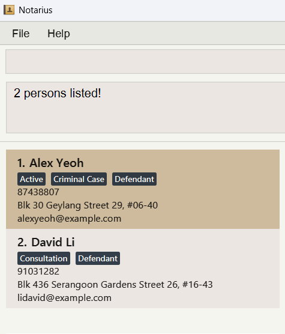
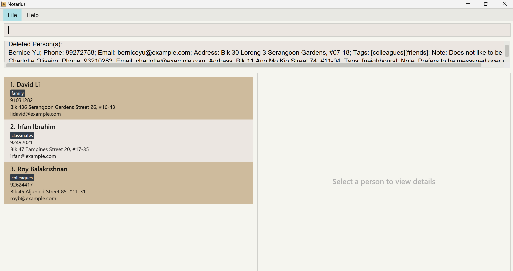

* Table of Contents
{:toc}

--------------------------------------------------------------------------------------------------------------------

## Introducing Notarius

> __*Managing client contacts should not slow you down.*__

**Notarius** is a desktop address book application
designed for **fast typing lawyers**
who need a **quick and efficient** way to manage client contacts. It comes with a **simple and intuitive** graphical interface
for a **clear and organised** view of your client contacts.

## Features Overview

**Notarius** comes with the expected features of an address book application in allowing you to
add, list, edit and delete client contacts.

Furthermore, **Notarius** also comes with **additional features** and **quality of life** to drive your **productivity** at work:

| Feature         | Overview                                                                                                                                                       |
|-----------------|----------------------------------------------------------------------------------------------------------------------------------------------------------------|
| Notes           | Change and view notes of your client contacts to keep track of short snippets of specific information about your clients especially when reaching out to them. |
| Pin/Unpin       | Pin and unpin client contacts to track important client contacts easier.                                                                                       |
| Sort            | Sort clients contacts using different criteria for greater organisation and quicker lookups.                                                                   |
| Find            | Find specific client contacts.                                                                                                                                 |
| Undo/Redo       | Undo your mistakes and use redo in case you did not want to undo.                                                                                              |
| Command History | View and reaccess what you previously typed.                                                                                                                   |

## Glossary of terms

While exploring this user guide, you may come across some terms that you may not be familiar with.
Here is a list of commonly used terminology to provide better clarity.

| Terms                 | Meaning                                                                                                                                                                                                                                                                                                                     |
|-----------------------|-----------------------------------------------------------------------------------------------------------------------------------------------------------------------------------------------------------------------------------------------------------------------------------------------------------------------------|
| Prefix                | Prefixes are short markers that are used to specify the type of information following it. For instance, `n/` is a prefix that specifies that the data following it (up until another prefix) is the name of a client.                                                                                                       |
| Command/Command input | A command (input) is a specific instruction that you type into the input box to tell Notarius what to do. Commands help you interact with Notarius by performing actions like adding, searching, or deleting data. Commands that do not match actions that can be performed by Notarius will be considered invalid/unknown. |
| Index                 | Index refers to the position of a client in the list of clients displayed by Notarius. For example, an `INDEX` of 1 refers to the first client in the displayed list.                                                                                                                                                       |
| Operating System/OS   | The type of computer software that you are using, commonly referred to as OS. Examples include **Windows**, **macOS**, and **Linux**. Click <a href="https://en.wikipedia.org/wiki/Operating_system">here</a> to learn more.                                                                                                |
| Whitespace Character  | Usually refer to characters entered by a user's keyboard that are not visible. Examples include spaces (by pressing space-bar), tabs (by pressing the tab key), and new lines (from pressing enter).                                                                                                                        |
| Blank Inputs          | Inputs entered by you that are either empty or only contain whitespace characters.                                                                                                                                                                                                                                          |
| GUI                   | Stands for graphical user interface. It is a visual way of interacting with Notarius via menus, lists, buttons, etc.                                                                                                                                                                                                        |
| Parameter             | A parameter is a piece of information you give to a command so Notarius knows what to do.                                                                                                                                                                                                                                   |

## Quick start

1. Ensure you have Java `17` or above installed in your Computer. 
   **Mac users:** Ensure you have the precise JDK version prescribed [here](https://se-education.org/guides/tutorials/javaInstallationMac.html).

1. Download the latest `.jar` file from [here](https://github.com/AY2425S2-CS2103T-T17-1/tp/releases). 
   * Under `Assets` of the latest release, click on `[CS2103T-T17-1][Notarius].jar` to download it.

1. Copy the file to an empty folder where you want to store all your contact information for Notarius.

1. Follow the steps for your device:

Windows
    
    1. Copy the path of the folder
        - Right-click the folder.
        - Select "Copy as Path".

    2. Open a command terminal
        - Press Win + X, then select Terminal.

    3. Navigate to the folder
        - Type "cd" and paste the copied path, then press Enter.

    4. Run the application
        - Type "java -jar [CS2103T-T17-1][Notarius].jar" and press Enter.

MacOS
    
    1. Copy the path of the folder
        - Right-click the folder, hold Opt.
        - Click "Copy (folder name) as Pathname".

    2. Open a command terminal
        - Press Cmd + Space to open Spotlight, type "Terminal", and press Enter.

    3. Navigate to the folder
        - Type "cd" and paste the copied path, then press Enter.

    4. Run the application
        - Type "java -jar [CS2103T-T17-1][Notarius].jar" and press Enter.

Linux
    

    1. Copy the path of the folder
        - Click the address bar of the folder(this might require pressing Ctrl + L).
        - Copy with Ctrl + C.

    2. Open a command terminal
        - Press Ctrl + Alt + T.

    3. Navigate to the folder
        - Type "cd" and paste the copied path, then press Enter.

    4. Run the application
        - Type "java -jar [CS2103T-T17-1][Notarius].jar" and press Enter.

 
A GUI similar to the below should appear in a few seconds. Note how the app contains some sample data.

1. Type the command in the input box and press Enter to execute it. e.g. typing **`help`** and pressing Enter will open the help window. 
   Some example commands you can try:

    * `list` : Lists all contacts.

    * `add n/John Doe p/98765432 e/johnd@example.com a/John street, block 123, #01-01` : Adds a contact named `John Doe` to the Address Book.

    * `delete 3` : Deletes the 3rd contact shown in the current list.

    * `clear` : Deletes all contacts.

    * `exit` : Exits the app.

1. Refer to the [Features](#features) below for details of each command.

--------------------------------------------------------------------------------------------------------------------

## Navigating the GUI

* At the main window, you can type the commands in the input box. The results of your commands will show up in the command output.
* In the **contacts list**, it will show all the contacts stored in Notarius.

  

* When a contact is selected, you can view more details at the **contact information card**.

  

* At the **contact list** on the left, you can view the name, phone number, address, email and tags of the person. When a person is pinned, the pin icon will show up.

  

* At the **contact information card** on the right, you can view the person's note.

  

--------------------------------------------------------------------------------------------------------------------

## Features

### Understanding Command Formats

#### Command Words
Each command starts with a command word, such as `add`, `list`, `exit`, etc.
 
A command word tells Notarius what action you want to perform, like adding a client contact or listing all client contacts.

:information_source: **Note about command words:**
 
Commands words are case sensitive. 
 
Always type command words exactly as shown. 
 
Example:  `add` command word is different from `Add` or `ADD`.

#### Parameters
Parameters are written in `UPPER_CASE`. These are placeholders you replace with your own info.
 
 
Example: In `add n/NAME`, `NAME` is a parameter which can be used as `add n/John Doe`.

:information_source: **Note about parameters:**
 
Parameters can be in any order. 
 
Example: If the command specifies `n/NAME p/PHONE_NUMBER`,
`p/PHONE_NUMBER n/NAME` is also acceptable.

#### Index
The index is a special parameter and refers to the index numbers shown in the displayed client contacts list.

  

:exclamation: **Constraints:** 
* The indexes **must be a positive integer** from 1, 2, 3, …   
* All specified indexes in commands must correspond to some index number shown in the displayed client contacts list

#### Optional Parameters
Items in square brackets are optional. It means you do not have to include this piece of information
if you do not want to.
 
 
Examples: `n/NAME [t/TAG]` can be used as `n/John Doe t/friend` or as `n/John Doe`.

#### ... Parameters
Items with `…`​ after them. You can use it once, multiple, or not at all.
 
 
Examples: 
`n/NAME [t/TAG]…​` can be used as
 
No Tag:
`n/NAME`
 
One Tag:
`t/case44`
 
Many Tags:
`t/case44 t/personal injury`
`t/case44 t/personal injury t/referred`

:information_source: **Note about parameters:**
 
Extraneous parameters for commands that do not take in parameters (such as `list`, `exit`, `undo` and `clear`) will be ignored. 
 
Example: if the command specifies `list 123`, it will be interpreted as `list`.

:exclamation: **Caution:**
If you are using a PDF version of this document, be careful when copying and pasting commands that span multiple lines as space characters surrounding line-breaks may be omitted when copied over to the application.

### Basic Features

#### Viewing help : `help`

The `help` command provides guidance on how to use the application, including available commands and their formats.

Format: `help [COMMAND]`

`COMMAND` is the command word of the command you are trying to get help for.

There are two ways to use the help command:

| Formats        | Purpose                          |
|----------------|----------------------------------|
| `help`         | Displays usage for all commands. |
| `help COMMAND` | Displays specific command usage. |

:exclamation: **Constraint:**
 
The `COMMAND` must be a valid command word.

:bulb: **Tip:** 
Case-insensitive command lookup (e.g.`help FiNd` works for `find`).

Examples:
* `help` displays the usage of all commands.
* `help add` displays the correct format and usage of the `add` command.
* `help me` returns: `"Unknown command! Use 'help' to see available commands.`

#### Adding a client contact: `add`

Adds a client contact to the address book.

Format: `add n/NAME p/PHONE_NUMBER e/EMAIL a/ADDRESS [t/TAG]…​`

:bulb: **Tips:**

* A client contact is considered a duplicate if another client contact has the same email (case-insensitive)
  and this duplicate email will be rejected.

* Any additional white spaces detected in name, address, tags will be trimmed.

:exclamation: **Constraints:** 

* A client contact is considered a duplicate if another client contact has the same email(case-insensitive)
and this duplicate email will be rejected. 
* Phone number must be a number with 3 to 15 digits.

Examples:
* `add n/John Doe p/98765432 e/johnd@example.com a/John street, block 123, #01-01`
* `add n/Betsy Crowe t/DUI e/betsycrowe@example.com a/Newgate Prison p/1234567 t/case44`

#### Listing all client contacts : `list`

Shows a list of all contacts in the address book.

Format: `list`

#### Editing a client contact : `edit`

Updates an existing client contact in the address book.

Format: `edit INDEX [n/NAME] [p/PHONE] [e/EMAIL] [a/ADDRESS] [t/TAG] [t/ADDITIONAL TAG]…​`

* Edits the client contact at the specified `INDEX`. 

:exclamation: **Constraints:** 
* A client contact is considered a duplicate if another client contact has the same email(case-insensitive)
and this duplicate email will be rejected.  
* Phone number must be a number with 3 to 15 digits.  
* You must provide at least one of the optional details to update.  

:information_source: **Notes about editing client contacts:**
* Any details you change will replace the old ones.  
* If you edit tags, the old tags are removed and replaced with the new ones.  
* To remove all tags, you can type t/ without adding any tag name after it.

Examples:
*  `edit 1 p/91234567 e/johndoe@example.com` Edits the phone number and email address of the 1st contact to be `91234567` and `johndoe@example.com` respectively.
*  `edit 3 t/Custody t/Case45` Overwrite the currents tag(s) of the 3rd contact with `Custody` and `Case45`.
*  `edit 2 n/Betsy Crower t/` Edits the name of the 2nd contact to be `Betsy Crower` and clears all existing tags.

#### Locating client contacts by name: `find`

The `find` command allows you to search for contacts based on their name,
phone number, email, address, or tags.

Format: `find [n/"NAME" "MORE_NAMES"] [p/"PHONE" "MORE_PHONES"]
[e/"EMAIL" "MORE_EMAILS"] [a/"ADDRESS" "MORE_ADDRESSES"]
[t/"TAG" "MORE_TAGS"] `

:exclamation: **Constraints:** 
* Use double quotation marks (") around each keyword to ensure correct parsing.   
* The search is case-insensitive. e.g the name `hans` will match `Hans`

:information_source: **Notes about finding client contacts:**
* You can search by `name`, `phone number`, `email`, `address`, or `tags`.  
* Allows small typos for `name`, `email` and `address` fields:
    - e.g. Searching for `David av` will match `David Li`.
    - Searching for `Bbo@example.com` will match `Bob@example.com.`  
* If no prefix (e.g. n/) is given, find by name is assumed.
    * e.g. `find Alice Bernice` is treated as `find n/"Alice" "Bernice"`  
* Supports multiple entries per field:
    - e.g. `find n/"Alice" "Bob" p/"98765432" "91234567"`,
      matches contacts named `Alice` or `Bob`, or with phone numbers `98765432` or `91234567`.

Examples:
* `find Alex` returns `Alex Yeoh`
* `find n/"Alxe" "Davdi"` returns `Alex Yeoh`, `David Li`
* `find p/"87438807" "91031282"` returns `Alex Yeoh` and `David Li` 

#### Deleting client contact(s) : `delete`

Deletes specified **client** contact(s) from your list of contacts in Notarius.

To speed up clearing out your client contacts, **Notarius** allows deleting multiple client contacts quickly,
depending on your needs: 

| Formats                                               | Purpose                                                                                                   |
|-------------------------------------------------------|-----------------------------------------------------------------------------------------------------------|
| Single-delete: `delete INDEX`                         | Deletes a **single** client contact at the specified `INDEX`                                              |
| Ranged-delete: `delete i/START_INDEX-END_INDEX`       | Deletes **consecutive** client contacts whose indexes are between `START_INDEX` to `END_INDEX` inclusive. |
| Spaced-delete: `delete i/FIRST_INDEX [MORE_INDEXES]…` | Deletes multiple client contacts from **different** parts of the client contact list by their indexes     |

:bulb: **Tip:** 

When deleting contacts with same tags, consider using the **find command** followed by **ranged-delete** to speed things up.

Examples:

* **Single-delete Format:**
    * `list` followed by `delete 2`
        * Deletes the 2nd client contact displayed in the list of client contacts from the top.
    * `find n/"Betsy"` followed by `delete 1`
        * Deletes the 1st client contact in the displayed results of the `find` command.

* **Ranged-delete Format:**
    * `list` followed by `delete i/1-2`
        * Deletes the 1st and 2nd client contacts in the list of client contacts from the top.
    * `find n/"Alex"` followed by `delete i/1-2`
        * Deletes the 1st and 2nd client contacts in the displayed results of the `find` command.

* **Spaced-delete Format:**
    * `list` followed by `delete i/1 2 3`
        * Deletes the 1st, 2nd and 3rd client contacts in the list of client contacts from the top.

Example: Deleting the first 3 client contacts after <code>list</code> using
<code>delete i/1-3</code>

 

**:exclamation: Index constraints:** 
* For ranged and spaced delete formats, duplicate indexes specified will be treated *as-if* that index was specified only once.

* Up to 100 **unique** indexes (duplicates are not part of this count!) can be specified (either via spaced or ranged delete formats); beyond which the command will fail.

* At least 1 index should be specified when using ranged or spaced delete formats.

* For ranged-delete format, `START_INDEX` must be at most equal to `END_INDEX` (For e.g. `delete i/3-2` is invalid).

### Special Features

#### Sorting of client contacts : `sort`

Sort the contacts in Notarius by specified prefixes in lexicographical order.

Format: `sort PREFIX`

For **sorting by one prefix**, the following commands are allowed:
* `sort n/` sorts contacts by ascending names.
* `sort p/` sorts contacts by ascending phone numbers.
* `sort e/` sorts contacts by ascending emails.
* `sort a/` sorts contacts by ascending addresses.
* `sort t/` sorts contacts by ascending tags.

For **sorting by two prefixes**, the first prefix must be `t/`. The following commands are allowed:
* `sort t/ n/` sorts contacts by tags first, followed by names.
* `sort t/ p/` sorts contacts by tags first, followed by phone numbers.
* `sort t/ e/` sorts contacts by tags first, followed by emails.
* `sort t/ a/` sorts contacts by tags first, followed by addresses.

**:exclamation: Sorting constraints:** 

* You are only allowed to use up to **two prefixes**.

* All other sorting combinations, other than those listed above, are **not allowed**.

Examples:
* `sort n/` returns contact by ascending names `Alex`, `Bernice`, `Charlotte`.
* `sort p/` returns contact by ascending phone numbers `87438807`, `91031282`, `92492021`.

**:information_source: Notes about sorting:** 

* **Adding New Contacts:** 
  After performing a sort, newly added contacts will **not** automatically be inserted in the 
correct sorted order. To maintain the sorted order, you will need to run the `sort` command again after adding the new contact.

* **Sorting Multiple Tags:** 
  It sorts the **first tag** in **alphabetical order**. 
  * `t/Criminal Case t/Defendant` will sort by `Criminal Case` tag first and followed by `Defendant` tag. 
  * `t/Criminal Case t/Defendant` and `t/Plantiff t/Criminal Case` are sorted, `t/Criminal Case t/Defendant` will appear before
  `t/Plantiff t/Criminal Case`, because `Criminal Case` tag comes first in the sorting order.

#### Pinning a client contact : `pin`

Pins the specified client contact to the top of the address book. 

Format: `pin INDEX`

Pins the contact at the specified `INDEX` to the top of the list.

:information_source: **Note about pinning:** 
If a client contact is already pinned, and you pin them, they will still be pinned.

Examples:
* `list` followed by `pin 2` pins the 2nd contact in the address book to the top.
* `sort p/` followed by `pin 1` pins the 1st contact when sorted according to phone number.

#### Unpinning a pinned client contact : `unpin`

Unpins the specified contact from the top of the address book if they were previously pinned. 

Format: `unpin INDEX`

Unpins the contact at the specified `INDEX`. 

:information_source: **Note about unpinning:** 
If a client contact is already unpinned, and you unpin them, they will still be unpinned.

Examples:
* `list` followed by `unpin 1` unpins the 1st contact in the address book.
* `sort p/` followed by `unpin 1` unpins the 1st contact when sorted according to phone number.

#### Clearing all entries : `clear`

Clears all client contacts in the address book.

Format: `clear`

#### Adding/Changing a note : `note`

Changes a note of a client contact in the address book.

Format: `note INDEX [nt/NOTE]`

Changes the note of the client contact at the specified `INDEX`.

:bulb: **Tip:**  
You can change a note into a blank note by typing `note INDEX` without a `NOTE`. 

Example:
* `note 3 nt/Away for a long time` changes the note of the 3rd client contact from the top
  in the address book into "Away for a long time".
* `sort n/` followed by `note 2` changes the note of the
  2nd client contact from the top listed in the sorted address book.
* `note 1` changes the note of the 1st client contact from the top into a blank note.

#### Viewing a note : `viewnote`

Displays the contents of a note of a particular client contact in the address book.

Format: `viewnote INDEX`

Displays the note of the client contact at the specified `INDEX`.

Example:
* `viewnote 3` displays the note of the 3rd client contact from the top.
* `viewnote 1` displays the note of the 1st client contact from the top.

#### Undoing a command : `undo`

Undoes a command.

Format: `undo`

:exclamation: **Constraint:** 
There should be a previous command to undo.

Examples:
* `undo` undoes the last command.
* `pin 4` followed by `undo` undoes the pin on the 4th client contact from the top in the address book.

#### Redoing a command : `redo`

Redoes an undone command.

Format: `redo`

:information_source: **Note about redoing:** 
An undone command is a previously typed command that was reversed by the `undo` command  

:exclamation: **Constraint:** 
There should be an undone command to redo.

Examples:
* `redo` redoes the last undone command.
* `pin 4` followed by `undo` followed by `redo` results in
  there being a pin on the 4th client contact from the top in the address book.

#### Command history

We know it can be **very annoying** to re-type commands consisting of long client details, especially due to typos.

As such, **Notarius** keeps a history of the command inputs you have entered. When the command history is open,
the inputs shown are **ordered** from the **most recently** entered input at the **top** to the **least recently**
entered input at the **bottom**. Furthermore, the **currently selected input** in the command history
is automatically entered into the input bar, as shown below:

![[commandHistoryOrder]](images/commandHistoryOrder.png)

Example: Older and newer command inputs in the command history
 
The currently selected input is "more recently entered command input"

 

You can open and navigate through this history by using various shortcuts below, depending on your operating system:

**Windows/Linux users:** Use `Ctrl + Up` key combination to scroll up the command history, and `Ctrl + Down` arrow key combinations to scroll down.

**macOS users:** Use `Ctrl + Opt + Up` and `Ctrl + Opt + Down` arrow key combinations to respectively scroll up and down instead.

:bulb: **Tips:**

* Pressing **either** of the key combinations above **based on** your operating system will **open** the command history.

* You can **close** the command history by either pressing `Enter` to submit the command input, or the `Escape` key.

* Don't worry if you typed an invalid command input, simply use the command history to re-access it again. **Notarius** saves them too.

 

**Scrolling up** or **down** the command history simply refers to moving the **currently selected input** of the command history 
to a **more recent/newer** or **less recent/older** command input respectively.

:information_source: **Important Notes:** 

* When the **currently selected input** is at the top of the command history, scrolling up another time will bring it down to the **oldest** input at the bottom of the command history.

* Similarly, when the **currently selected input** is at the bottom of the command history, scrolling down another time brings it back to the **newest** input at the top of the command history.

 

:exclamation: **Constraints:** 

* Blank inputs (including empty inputs) are not useful command inputs and won't be added.

* Restarting or closing the application will clear the command history.

* Inputs that are duplicates of the previously saved command history input will not be added another time.

* Up to 20 of your most recently entered inputs will be saved in the command history.

### Exiting the program : `exit`

Exits the program.

Format: `exit`

### Saving the data

Data from Notarius is saved in the hard disk automatically after any command that changes the data. There is no need to save manually.

### Editing the data file

Notarius data are saved automatically as a JSON file `[JAR file location]/data/addressbook.json`. Advanced users are welcome to update data directly by editing that data file.

:exclamation: **Caution:**
If your changes to the data file makes its format invalid, AddressBook will discard all data and start with an empty data file at the next run. Hence, it is recommended to take a backup of the file before editing it. 
Furthermore, certain edits can cause the AddressBook to behave in unexpected ways (e.g., if a value entered is outside of the acceptable range). Therefore, edit the data file only if you are confident that you can update it correctly.

--------------------------------------------------------------------------------------------------------------------

## FAQ

**Q: How can I check my Java version?** 
A: You can open a command line and type `java -version`. If you do not have Java installed, you can install **Java 17**
using the Oracle guide [here](https://www.oracle.com/java/technologies/downloads/#java17). Alternatively, you can install the OpenJDK version. For macOS users, you may wish to follow the instructions [here](https://nus-cs2103-ay2425s2.github.io/website/admin/programmingLanguages.html).

**Q: How do I save my data?** 
A: Data is saved in the hard disk automatically after any commands that changes the data.

**Q: Do I need an internet connection to use Notarius?** 
A: All functionalities can be used offline, hence no internet connection is required.

**Q: What are the available commands in Notarius?** 
A: Please refer to the [Command Summary](#command-summary) for the list of available commands.

--------------------------------------------------------------------------------------------------------------------

## Known issues

1. **When using multiple screens**, if you move the application to a secondary screen, and later switch to using only the primary screen, the GUI will open off-screen. The remedy is to delete the `preferences.json` file created by the application before running the application again.
2. **If you minimize the Help Window** and then run the `help` command (or use the `Help` menu, or the keyboard shortcut `F1`) again, the original Help Window will remain minimized, and no new Help Window will appear. The remedy is to manually restore the minimized Help Window.
3. When specifying the index of commands that take in an `INDEX` as parameter(s) (such as `delete INDEX`, `pin INDEX`, `unpin INDEX`, `viewnote INDEX`, `edit INDEX ...`, etc.), if the `INDEX` specified is **not** a positive integer **within** the range of 1 and 2147483647 **inclusive**, the application will show "Invalid command format!" instead.
4. (**Some Linux computers only**) On fresh startup of the application, the size of the window cannot be modified. Only after maximising and then minimising the application, the size of the window can be modified.

--------------------------------------------------------------------------------------------------------------------

## Command summary

| Action              | Formats and Examples                                                                                                                                                                                                                                                              |
|---------------------|-----------------------------------------------------------------------------------------------------------------------------------------------------------------------------------------------------------------------------------------------------------------------------------|
| **Add**             | Format: `add n/NAME p/PHONE_NUMBER e/EMAIL a/ADDRESS [t/TAG] [t/ADDITIONAL TAG]…`     Example: `add n/James Ho p/22224444 e/jamesho@example.com a/123, Clementi Rd, 1234665 t/plaintiff t/client`                                                                           |
| **Clear**           | Format: `clear`     Example: `clear`                                                                                                                                                                                                                                        |
| **Delete**          | Single-delete Format: `delete INDEX`     Example: `delete 3`     Ranged-delete Format: `delete i/START_INDEX-END_INDEX`     Example: `delete i/1-2`     Spaced-delete Format: `delete i/FIRST_INDEX [MORE_INDEXES]… `     Example: `delete i/1 3 5` |
| **Edit**            | Format: `edit INDEX [n/NAME] [p/PHONE_NUMBER] [e/EMAIL] [a/ADDRESS] [t/TAG] [t/ADDITIONAL TAG]…`     Example: `edit 2 n/James Lee e/jameslee@example.com`                                                                                                                   |
| **Find**            | Format: `find [n/"NAME" "MORE_NAMES"] [p/"PHONE" "MORE_PHONES"] [e/"EMAIL" "MORE_EMAILS"] [a/"ADDRESS" "MORE_ADDRESSES"] [t/"TAG" "MORE_TAGS"]`     Example: `find n/"James" "Jake"`                                                                                        |
| **List**            | Format: `list`     Example: `list`                                                                                                                                                                                                                                          |
| **Add/Change Note** | Format: `note INDEX [nt/NOTE]`     Example: `note 3 nt/Currently in jail.`                                                                                                                                                                                                  |
| **View Note**       | Format: `viewnote INDEX`     Example: `viewnote 3`                                                                                                                                                                                                                          |
| **Pin**             | Format: `pin INDEX`     Example: `pin 2`                                                                                                                                                                                                                                    |
| **Unpin**           | Format: `unpin INDEX`     Example: `unpin 1`                                                                                                                                                                                                                                |
| **Sort**            | Format: `sort ATTRIBUTE`     Example: `sort n/`                                                                                                                                                                                                                             |
| **Undo**            | Format: `undo`     Example: `undo`                                                                                                                                                                                                                                          |
| **Redo**            | Format: `redo`     Example: `redo`                                                                                                                                                                                                                                          |
| **Help**            | Format: `help [COMMAND]`     Example: `help add`                                                                                                                                                                                                                            |
| **Exit**            | Format: `exit`     Example: `exit`                                                                                                                                                                                                                                          |
